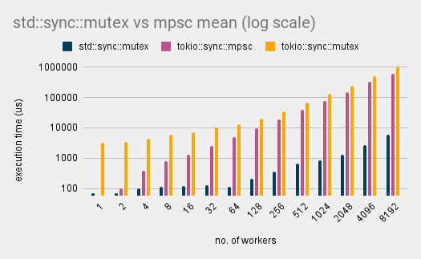

+++
title = "Avoiding Over-Reliance on mpsc channels in Rust for Better Performancest"
description = "Thoughts and ideas on how to avoid over relying on `mspc` channels when simpler or more effective patterns can be used."
date = 2024-04-19
[taxonomies]
tags = ["rust", "engineering"]

[extra]
note = "Shoutout to the folks over at [/r/rust](https://www.reddit.com/r/rust/comments/1cdv300/combatting_overreliance_on_mpsc_channels/) that helped guide some of the initial improvements in this post."
+++

# Introduction

Channels in Rust are a really powerful tool for allowing cross-thread communication. I have used them in just about every single project, professional and personal. They enable a message passing pattern between threads that is safe, efficient, and dare I say, fun. This is particularly the case when using Tokio [`mpsc`](https://docs.rs/tokio/latest/tokio/sync/mpsc/fn.channel.html) channels and utils such as [`select!`](https://docs.rs/tokio/latest/tokio/macro.select.html). They really allow you to design actor-based systems that are quite resilient to change while doing a good job at utilising the underlying hardware.

During a recent [livestream](https://youtu.be/o2ob8zkeq2s?t=11328), Jon Gjengset raised a point which stuck with me. There are situations were I might be over-relying on `mpsc` channels. Situations that typically look like a fan-in pattern where we have a large number of producers and a single consumer. When we have a relatively small and stable number of producers, this pattern works well.


Significantly increasing the number of producers can lead to congestion on the consumer side, where the overhead of receiving and processing a message can lead to message backlog or messages being dropped. This is particularly dangerous when there is no backpressure and producers keep producing messages at a faster rate than the consumer can process them.


This post will explore an alternative method of enabling this fan-in pattern and explore its performance characteristics.

## Baseline

Imagine a situation where we have a large burst of data that we need to quickly process and send to a streaming client. This is what we do with [Have I Been Squatted?](https://haveibeensquatted.com/). You input a domain in the input box and we generate a large number of possible permutations using [`twistrs`](https://github.com/haveibeensquatted/twistrs). The permutations are then enriched with all sorts of data (e.g., geolocation, rdap/whois, server banners) and streamed back to you as quickly as possible.

As a baseline, we'll have a simple [socket server](https://github.com/JuxhinDB/buffered-mpsc/blob/main/server/src/main.rs) that listens to incoming tcp connections from a client. Think of this as a simple client-server connection.

```rust
loop {
    match socket.read(&mut buf).await {
        Ok(0) => return,
        Ok(n) => {
            println!(
                "received {} bytes, msg: {}",
                n,
                String::from_utf8_lossy(buf.clone()[..n].to_vec().as_slice())
            );

            socket
                .write_all(&buf[..n])
                .await
                .expect("failed to write data to socket");
        }
        Err(e) => {
            eprintln!("failed to read from socket; err = {e:?}");
            return;
        }
    }
}
```

An actor client can be as simple as the following serial mpsc consumer.

```rust
// Wait for a message from one of our workers and send it to the server
loop {
    match rx.recv().await {
        Some(msg) => stream.write_all(&[msg]).await?,
        None => eprintln!("received none from channel"),
    };
}
```

### Using `mpsc`

Our first implementation for solving this problem can use an `mpsc` channel, where we have a single consumer, sending messages through the socket, and a large number of producers enriching some data. We name these `actor` and `worker` respectively.

```rust
pub async fn serial_worker(tx: UnboundedSender<u8>, samples: usize) {
    let mut potato = 0;

    for _ in 0..samples {
        potato = (potato + 1) % 255;

        if let Err(e) = tx.send(potato) {
            eprintln!("tx err: {:?}", e.0);
            break;
        }
    }
}

pub async fn serial_actor(mut rx: UnboundedReceiver<u8>) -> io::Result<()> {
    let mut stream = stream().await?;

    loop {
        match rx.recv().await {
            Some(msg) => stream.write_all(&[msg]).await?,
            None => eprintln!("received none from channel"),
        };
    }
}
```


### Using `Arc<Mutex<Vec<_>>>`

An alternative approach is to instead rely on `Arc<Mutex<Vec<_>>>` to act as our buffer. The important aspects are the following:

* We must minimise allocations, so we pre-allocate two buffers which are swapped between the worker and actor.
* We must minimise contention so our critical sections are as small as possible.
* We avoid the use of tokio's `Mutex` in favour of `std::sync::Mutex`.

Starting with our worker, which will look very similar to the `mpsc` worker.

```rust
pub async fn mutex_worker(buf: Arc<Mutex<Vec<u8>>>, samples: usize) {
    let mut potato = 0;

    for _ in 0..samples {
        potato = (potato + 1) % 255;

        let mut buf = buf.lock().unwrap();
        buf.push(potato);
        drop(buf);
    }
}
```

The actor is where things get interesting. We need to be able to swap the buffers between the worker and actor. This is done by using a `std::sync::Mutex` to lock the buffer and swap it with a new buffer. This is done in the critical section to avoid contention.

```rust
#[allow(clippy::await_holding_lock)]
pub async fn mutex_actor(buf: Arc<Mutex<Vec<u8>>>, samples: usize) -> io::Result<()> {
    // NOTE(jdb): We only allocate two buffers, whenever the consumer
    // consumes, it swaps the worker buffer with the current buffer
    // that is empty, and the current buffer is then consumed/cleared.
    let mut buffer = Vec::with_capacity(samples);
    let mut stream = stream().await?;

    loop {
        let mut current = buf.lock().unwrap();

        // Swap the buffer with an empty one.
        std::mem::swap(&mut buffer, &mut *current);
        drop(current);

        // Consume the buffer
        stream.write_all(&buffer).await?;
    }
}
```

This has the benefit of consuming as many messages as possible in a single pass, improving the overall throughput.

### Sidenote &mdash; impact of `tokio::sync::Mutex` versus `std::sync::Mutex`

The astute among you might notice the `clippy::await_holding_lock` above. This is because we are using `std::sync::Mutex` instead of `tokio::sync::Mutex` &mdash; this is fine as we are actually not holding the lock across an `await` point due to the explicit `drop` call. Initially I had used `tokio::sync::Mutex`; the performance was significantly worse. About ≈25x worse as you'll see further on. You can find the profiling results in the appendix below.

This is a critical point to understand when using `std::sync::Mutex` in an async context, as it can lead to deadlocks if not handled correctly. As a rule of thumb, always use the `std::sync::Mutex` first, and only switch to `tokio::sync::Mutex` if you need to.


## Results

> **Note** — the server buffer size is set to 65536 bytes, high enough that it should not cause any backpressure on the client. These benchmarks were run on an AMD Ryzen 9 5900HS/NVIDIA 3080 with 32GB of memory.

Running a number of benchmarks reveals provides us with some insights. The graph below is in log scale, across benchmarks using `mpsc`, tokio's `Mutex`, and `std::sync::Mutex`.




At very small numbers of workers, the `std::sync::Mutex` implementation is slower than the `mpsc` implementation. This is likely due to the overhead of the `Mutex` itself. However, as the number of workers increases, the `std::sync::Mutex` implementation quickly outperforms the `mpsc` implementation.

I added another benchmark using tokio's `Mutex` to see how it would compare. The result trajectory was what I expected, but the magnitude was really surprising. Simply using the _"wrong"_ mutex implementation  can erase all performance gains.

## Concluding thoughts

There are still a few more things to explore here. For starters, there are definitely some more optimisations to be had depending on the data within our workloads. Another alternative is looking to remove `Mutex` entirely in favor of [`AtomicPtr`](https://doc.rust-lang.org/std/sync/atomic/struct.AtomicPtr.html). This would allow us to avoid the contention of the `Mutex` entirely but requires some more non-trivial engineering.

Additionally I would like to extend these benchmarks to include validation checks to make sure that each implementation is actually sending the number of messages it should be sending.

All the hacky code for this post can be found [here](https://github.com/JuxhinDB/buffered-mpsc). Feel free to extend it and improve on it with your findings.

If you have any thoughts or ideas on how to improve this, please let me know. I am always looking to learn more.

## Appendix

### Results

Results from the benchmarks from `2^1` to `2^13` workers. Values are in microseconds (`μs`). The delta is the percentage difference between the `std::sync::Mutex` and `mpsc` implementations.

| workers | std::sync::mutex | tokio::sync::mpsc | tokio::sync::mutex |     %Δ    |
|---------|------------------|-------------------|--------------------|:---------:|
|       1 |           67.795 |             57.78 |             3159.9 |   -14.77% |
|       2 |           69.998 |            101.67 |             3500.4 |    45.25% |
|       4 |           103.49 |            394.86 |             4477.4 |   281.54% |
|       8 |           115.75 |            815.68 |             5988.5 |   604.69% |
|      16 |           117.54 |            1293.1 |             7336.6 |  1000.14% |
|      32 |           124.65 |            2511.6 |              10169 |  1914.92% |
|      64 |           114.49 |            4892.7 |              13300 |  4173.47% |
|     128 |           205.31 |            9850.9 |              20195 |  4698.06% |
|     256 |           367.57 |             19192 |              35342 |  5121.32% |
|     512 |           672.27 |             38542 |              68178 |  5633.11% |
|    1024 |           849.53 |             77073 |             132050 |  8972.43% |
|    2048 |           1279.4 |            148280 |             251470 | 11489.81% |
|    4096 |           2651.9 |            326080 |             513510 | 12196.09% |
|    8192 |           5778.9 |            618660 |            1075400 | 10605.50% |

### Profiling

Profiling results using [`cargo flamegraph`](https://github.com/flamegraph-rs/flamegraph) integrated with [criterion](https://www.jibbow.com/posts/criterion-flamegraphs/). The top flamegraph is the `std::sync::Mutex` implementation, the bottom is the `tokio::sync::Mutex` implementation.

<div class="img-container">
    <embed style="width:100%" src="./std-mutex.svg">
    <embed style="width:100%" src="./tokio-mutex.svg">
</div>
