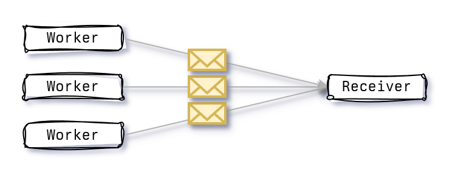

+++
title = "How to avoid over reliance on `mpsc` channels in Rust"
description = "Thoughts and ideas on how to avoid over relying on `mspc` channels when simpler or most effective patterns can be used."
date = 2024-04-19
[taxonomies]
tags = ["rust", "engineering"]

[extra]
note = "Shoutout to the folks over at [/r/rust](https://www.reddit.com/r/rust/comments/1cdv300/combatting_overreliance_on_mpsc_channels/) that helped guide some of the initial improvements in this post."
+++

# Introduction

Channels in Rust are a really powerful tool for allowing cross-thread communication. I have used them in just about every single project, both professional and personal (e.g., [Have I Been Squatted?](https://haveibeensquatted.com/)). They enable this message passing pattern between threads that is safe, efficient, and dare I say, fun. This is particularly the case when using Tokio [`mpsc`](https://docs.rs/tokio/latest/tokio/sync/mpsc/fn.channel.html) channels and utils such as [`select!`](https://docs.rs/tokio/latest/tokio/macro.select.html). They really allow you to design actor-based systems that are quite resilient to change while doing a good job at utilising the underlying hardware.

During a recent [livestream](https://youtu.be/o2ob8zkeq2s?t=11328), Jon Gjengset raised a point which stuck with me. There are situations were I might be over-relying on `mpsc` channels. Situations that typically look like a fan-in pattern where we have a large number of producers and a single consumer. When we have a relatively small and stable number of producers, this pattern works well.



Significantly increasing the number of producers can lead to congestion on the consumer side, where the overhead of receiving and processing a message can lead to message backlog or messages being dropped. This is particularly dangerous when there is no backpressure and producers keep producing messages at a faster rate than the consumer can process them.


This post will explore an alternative method of enabling this fan-in pattern and explore its performance characteristics.

## Baseline

Imagine a situation where we have a large burst of data that we need to quickly process and send to a streaming client. This is what we do with [Have I Been Squatted?](https://haveibeensquatted.com/). You input a domain in the input box and we generate a large number of possible permutations using [`twistrs`](https://github.com/haveibeensquatted/twistrs). The permutations are then enriched with all sorts of data (e.g., geolocation, rdap/whois, server banners) and streamed back to you as quickly as possible.

As a baseline, we'll have a simple [socket server](https://github.com/JuxhinDB/buffered-mpsc/blob/main/server/src/main.rs) that listens to incoming tcp connections from a client. Think of this as a simple client-server connection.

```rust
loop {
    match socket.read(&mut buf).await {
        Ok(0) => return,
        Ok(n) => {
            println!(
                "received {} bytes, msg: {}",
                n,
                String::from_utf8_lossy(buf.clone()[..n].to_vec().as_slice())
            );

            socket
                .write_all(&buf[..n])
                .await
                .expect("failed to write data to socket");
        }
        Err(e) => {
            eprintln!("failed to read from socket; err = {e:?}");
            return;
        }
    }
}
```

An actor client can be as simple as the following serial mpsc consumer.

```rust
// Wait for a message from one of our workers and send it to the server
loop {
    match rx.recv().await {
        Some(msg) => stream.write_all(&[msg]).await?,
        None => eprintln!("received none from channel"),
    };
}
```

### Using `mpsc`

Our first implementation for solving this problem can use an `mpsc` channel, where we have a single consumer, sending messages through the socket, and a large number of producers enriching some data. We name these `actor` and `worker` respectively.

```rust
pub async fn serial_worker(tx: UnboundedSender<u8>, samples: usize) {
    let mut potato = 0;

    for _ in 0..samples {
        potato = (potato + 1) % 255;

        if let Err(e) = tx.send(potato) {
            eprintln!("tx err: {:?}", e.0);
            break;
        }
    }
}

pub async fn serial_actor(mut rx: UnboundedReceiver<u8>) -> io::Result<()> {
    let mut stream = stream().await?;

    loop {
        match rx.recv().await {
            Some(msg) => stream.write_all(&[msg]).await?,
            None => eprintln!("received none from channel"),
        };
    }
}
```


### Using `Arc<Mutex<Vec<_>>>`

An alternative approach is to instead rely on `Arc<Mutex<Vec<_>>>` to act as our buffer. The important aspects are the following:

* We must minimise allocations, so we pre-allocate two buffers which are swapped between the worker and actor.
* We must minimise contention so our critical sections are as small as possible.
* We avoid the use of tokio's `Mutex` in favour of `std::sync::Mutex`.

Starting with our worker, which will look very similar to the `mpsc` worker.

```rust
pub async fn mutex_worker(buf: Arc<Mutex<Vec<u8>>>, samples: usize) {
    let mut potato = 0;

    for _ in 0..samples {
        potato = (potato + 1) % 255;

        let mut buf = buf.lock().unwrap();
        buf.push(potato);
        drop(buf);
    }
}
```

The actor is where things get interesting. We need to be able to swap the buffers between the worker and actor. This is done by using a `std::sync::Mutex` to lock the buffer and swap it with a new buffer. This is done in a critical section to avoid contention.

```rust
#[allow(clippy::await_holding_lock)]
pub async fn mutex_actor(buf: Arc<Mutex<Vec<u8>>>, samples: usize) -> io::Result<()> {
    // NOTE(jdb): We only allocate two buffers, whenever the consumer
    // consumes, it swaps the worker buffer with the current buffer
    // that is empty, and the current buffer is then consumed/cleared.
    let mut buffer = Vec::with_capacity(samples);
    let mut stream = stream().await?;

    loop {
        let mut current = buf.lock().unwrap();

        // Swap the buffer with an empty one.
        std::mem::swap(&mut buffer, &mut *current);
        drop(current);

        // Consume the buffer
        stream.write_all(&buffer).await?;
    }
}
```

This has the benefit of consuming as many messages as possible in a single pass, improving the overall throughput.

## Results
