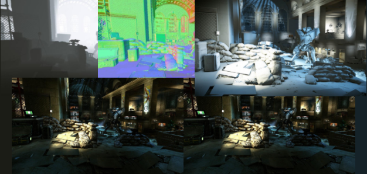
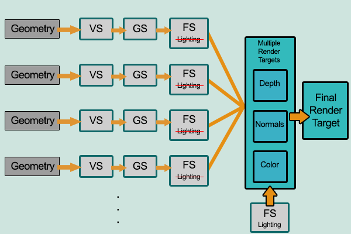

+++
title = "Introduction to Deferred Rendering"
description = "A brief introduction into the Deferred Rendering technique used in 3D graphics along with its historical context."
date = 2016-07-05
[taxonomies]
tags = ["graphics"]
+++
This article does not intend to delve into the process of coding an engine with a deferred rendering pipeline. The article shall overview the rendering technique in certain technical detail to give a better understanding of what is truly going on underneath the hood.

It also aims to clearly depict the pros and cons of such a technique and whether one ought to implement it in their engine or not.

## What is Deferred Rendering

The primary goal behind deferred rendering was to minimise the computer’s system resources via its pipeline mechanics. Whilst its counterpart follows a more linear approach (which too has its advantages) deferred rendering solves certain scene complexity by first rendering the scene’s basic attributes such as depth, normals and diffuse colour.

These are all stored in the g-buffer. Essentially the g-buffer contains full screen rendering targets with various information being stored within them to produce a final image.

The calculations are done on two separate passes. The first pass consists of the vertex shader(vs)[^1] and fragment shader(fs)[^2], these two shaders gather all the required attributes in order to perform the shading however no calculation actually occurs at this particular time. These attributes will depend on your shading.

Attributes such as:
 * Position
 * Normal
 * Color
 * Other (exponent maps, light maps, material ID etc.)

..are essentially required (the first three are mandatory). The fourth attribute will vary according to your shading thereby limiting lighting to a smaller number of parameters. Once all of this information is accumulated, the g-buffer is then generated.

The g-buffer grants the possibility to compute full lighting results for every pixel per light by solving the BRDF[^3] (bidirectional reflectance distribution function) just once as opposed to forward rendering which requires to calculate multiple times in order to render the final image properly.

The second stage is where the actual lighting calculations are performed. These calculations are still done the same way as it’s done in forward rendering except at the far end of the rendering pipeline. What is the point of all this? The idea is that a pixel will only be shaded if it’s actually actually on the screen otherwise if it’s not, why shade it? So once the pixel is in the imageview we are certain that it’s indeed going to be visible and can calculate all the lighting influence upon it without the doubt that the calculation may potentially go to waste. This alone helps it’s calculation complexity from `O(num_geometry_fragments * num_lights)` to `O(screen_resolution * num_lights)`[^4].

The above images represent the information within the g-buffer whilst the bottom is the result after the scene has all its objects light influence calculated.

> **Note** &mdash; this is a fairly primitive example that uses this technique. It uses the bare minimum information required within the g-buffer in order to perform and illustrate the final render with the lighting calculations. A very nice live demonstration of this can be found over here by a fellow Redditer.

## Applications

Deferred rendering is indeed a valuable technique to use when it comes to massively complex worlds that include dynamic lighting. The obvious question that arises here is whether deferred rendering is a technique to be used only by the elite companies within the gaming industry due to the fact that they produce high quality titles that require such light intensive calculations (i.e. Cyrsis 2)?

In order to answer this we ought to differentiate between engines that run solely on deferred pipeline and engines that implement both forward and deferred pipelines.

### First case study

X-Ray Engine (primarily versions 1.0, 1.5, 1.6), used in all of the “S.T.A.L.K.E.R” games. The noticeable thing about this engine was the fact that deferred lighting was used simply to calculate light accumulation in the environment. The rest of the engine still ran on forward rendering. What the developers decided to do (and bear in mind that this was during the infancy of deferred rendering as a mainstream technique in ‘07) was mix deferred rendering and the traditional forward rendering together for what they were respectively good at.

The former scaled extremely well with light calculations whilst the latter took care of transparency—something that deferred rendering could not do. They simply used the deferred pipeline to see how much light falls on particular fragments (in order to determine the colour) whilst the rest was calculated using traditional forward rendering. Such complex worlds contained numerous light sources both interior (lamps, light bulbs etc.) and exterior (sun, moon, light emitting material). Following such maps with forward rendering would create a huge bottleneck within the system making it unfeasible.

### Second case study

The CryEngine (particularly CryEngine3) focuses heavily on deferred rendering throughout all of its games which are indeed known for their aesthetic beauty. An interesting document presented by Tiago Sousa who was the Lead Rendering and Design graphics engineer under Crytek shows the transition from CryEngine2 and CryEngine3 and the importance of deferred rendering within their engine.

This shows that deferred rendering is often used by big companies that produce Triple-A titles due to the aesthetic advancement of such a technique alongside hardware advancement which is able to keep up with it.

For more information check out [CryENGINE 3 Graphics Gems](https://www.crytek.com/download/fmx2013_c3_art_tech_donzallaz_sousa.pdf).

## Pros & Cons

The primary advantage and the signature to the technique’s success lies in its power to calculate a large number of lights within the scene in an extremely efficient manner. This effectively reduces its complexity and wastes less resources.

There are indeed other minute advantages such as easier management of complex light and shader resources however nothing too distinct that’s explicitly worth mentioning. Whilst the advantages of deferred rendering are relatively straightforward, there are quite a few major disadvantages with this technique that truly question development companies whether they ought to use it or not. The first and probably the one that’s given most importance is the fact that it cannot handle transparency, or at least it’s very hard to without being at the cost of the g-buffer which is already a delicate component in terms of size.

The entire pipeline is somewhat harder to implement as it overrides the fixed pipeline and also requires a lot of manual shaders thus probably requiring a lot of shader code in order to function properly. Another major inconvenience would be the inability to handle AA (anti-aliasing) accurately due to the splitting of geometry and lighting calculations which are done on two separate passes; the reason for this being that hardware multi-sampling did not work (until recently) when rendering to texture—which is how most of deferred rendering is done which can then be sampled later on.

Though there are edge detection algorithms, which were considered hacks used at the time any GPU now comes out with anti-aliasing hardware such as FXAA (Fast approximate anti-aliasing) and MSAA (multi-sample anti-aliasing) to help with this major setback.

## Conclusion

The technique has definitely been given praise. It deserves every bit of recognition and whilst it isn’t a flawless technique, it has definitely given us many aesthetically great 3D games that were capable of running on home computers which is something we all ought to be grateful for. A few features have been omitted from this document such as SSAO (Screen Space Ambient Occlusion), SSDO (Screen Space Directional Occlusion) among others primarily due to the fact that they’re not directly dependent on the pipeline’s structure.

Credits ought to be given to the pioneers between years ‘88 – ‘90. If it weren’t for their sharp minds we might have still been using forward rendering till today or possibly learned about deferred rendering far later which would result in modern hardware to be less advanced that it currently is.

The history of this technique is intriguing to say the least, primarily due to the fact that that it hit the market a decade after the concept had been conceived properly with the introduction of the geometric buffer and hit the mainstream well over ~15 years later. One has to think, how many future techniques will be limited by our current hardware capabilities? My opinion is that an idea is constrained only by one’s imagination, however the real world has many more factors to account for, this is what will push the rate of growth of hardware immensely.

We must also look at the possibility of a new rendering technique being presented in the future, one that combines the perks of both forward and deferred rendering whilst minimising their drawbacks.

I would like to give a huge thanks to a close working friend, Thomas Vissier, who not only is a prospect in the field but also great teacher who inspired me to learn more about OpenGL and computer graphics. I would also like to thank [reddit](https://reddit.com/r/programming) for their continuous support on keeping this article correct and up to date.

## History

> **Note** &mdash; this section is for those that are interesting on the historical aspect of the rendering technique and does not provide any technical value.

The history of deferred rendering is primarily divided into two major stages—the origin of the technique and the actual implementation of it. Deferred rendering as a technique is often contrasted with a more traditionally known technique known as Forward Rendering which is still being used today throughout numerous rendering engines. Its popularity grew in recent years due to technological (especially hardware) advancements that were once the primary limitations for early adopters of deferred rendering. Since such limitations have now been disparaged the technique has been recognized throughout the world as an established rendering technique.

Forward rendering however has been the standard and commonly used technique for well over two decades. The growth of deferred rendering has definitely gathered a fair share of praise and criticism regarding whether it would ever wipe its counter-part out of the scene. Truth is like many things of this nature, I truly believe perfect harmony may only exist if one were to work with the other and not try to push it away. The two major techniques working together will guarantee systematic growth in computer graphics which ought to be a mutual goal across developers of such techniques however my lack of expertise in the development cycle of games may cause me to be incorrect.

Deferred rendering was initially introduced at SIGGRAPH by computer scientist and chief engineer for Sun Microsystems, Michael Deering in 1988, alongside Stephanie Winner, Bic Schediwy, Chris Duffy and Neil Hunt. This was named “The triangle processor and normal vector shader: A VLSI (very-large-scale integration) system for high performance graphics”.

However it was conceived as a proper concept in SIGGRAPH ‘90 by two rather ambiguous figures, Takafumi Saito and Tokiichiro Takahashi with their introduction of the g-buffer (geometry buffer) which is fundamentally used in order to implement this technique.

Although it isn’t of much relevance to many, the term ‘deferred’ had not yet been introduced at the time. The first video game that used deferred shading was Shrek published on the Xbox platform during 2001. Somewhere around 2004 implementations on actual hardware were being introduced to support such a technique. One should also note that PixelFlow were one of the first companies to implement deferred rendering in their media production architectures followed by support from Nvidia and DirectX and many others at the time. This goes to show the potentiality of this technique and how it had been recognised by many major companies in the field.

Its popularity finally hit the mainstream in video games circa 2008 with the famous Crysis 2 using the CryEngine(3). Other engines such as Unreal Engine and Unity also implemented this rendering technique alongside the well known forward rendering.

As the name suggests, the rendering is deferred (postponed). Everything is passed down the pipe normally from Vertex Shader to the Geometry shader then Fragment Shader to multiple rendering targets. Once that is complete everything is then shaded with the lighting. The fact that only pixels which are actually visible on the screen will have lighting calculations in order to determine their colour is the major advantage here.

One must bare in mind that the unlimited number of lights is also somewhat limited by the number of objects that must be drawn on the buffers in order to produce the final render due to the size constraints that come with them[^6].

## Sources

* CryENGINE3 Rendering Techniques – [http://www.crytek.com/cryengine/presentations/cryengine-3-rendering-techniques](http://www.crytek.com/cryengine/presentations/cryengine-3-rendering-techniques)
* Deferred Rendering Technique public thesis by Dionysios Toufexis – [www.dennisfx.com/wp-content/uploads/2013/02/Report_DRendering_Toufexis_D.pdf](www.dennisfx.com/wp-content/uploads/2013/02/Report_DRendering_Toufexis_D.pdf) (Thesis)
* Simple OpenGL Deferred Rendering by Marco Alamia – [http://www.codinglabs.net/tutorial_simple_def_rendering.aspx](http://www.codinglabs.net/tutorial_simple_def_rendering.aspx) (Article)
* Deferred Shading – [https://en.wikipedia.org/wiki/Deferred_shading#cite_note-52](https://en.wikipedia.org/wiki/Deferred_shading#cite_note-52) (Wiki)
* Forward Rendering VS Deferred Rendering by Brient Owens – [http://gamedevelopment.tutsplus.com/articles/forward-rendering-vs-deferred-rendering–gamedev-12342](http://gamedevelopment.tutsplus.com/articles/forward-rendering-vs-deferred-rendering–gamedev-12342) (Article)
* Disadvantages of Deferred Shading by ogre3d community – [http://www.ogre3d.org/tikiwiki/tiki-index.php?page=Deferred+Shading#Deferred_Shading_Disadvantages](http://www.ogre3d.org/tikiwiki/tiki-index.php?page=Deferred+Shading#Deferred_Shading_Disadvantages) (Wiki)

[^1]: https://www.opengl.org/wiki/Vertex_Shader: Extended description of shaders (specifically vertex shaders). The reason they aren’t explained in detail in the document is due to the fact that it’s a fundamental component in both rendering pipelines and not only used within deferred rendering.

[^2]: https://www.opengl.org/wiki/Fragment_Shader: Extended description of shaders (specificaly fragment shaders). The reason they aren’t explained in detail in the document is due to the fact that it’s a fundamental component in both rendering pipelines and not only used within deferred rendering.

[^3]: https://www.cs.ucla.edu/~zhu/tutorial/An_Introduction_to_BRDF-Based_Lighting.pdf: A far more detailed article illustrating the power of directional reflectance distribution function and it’s role in modern GPUs.

[^4]: https://www.interviewcake.com/big-o-notation-time-and-space-complexity: Explains into more detail what I meant by “O(geometry * lights) to O(geometry + lights)” and explains how BigO is used to measure algorithm efficiency and those allows us to compare the speed of forward rendering vs deferred rendering.

[^5]: https://www.crytek.com/cryengine/presentations/cryengine-3-rendering-techniques: Certain information has been omitted from the paragraph to avoid extra confusion with terms that don’t directly partake in the structure of the deferred pipeline such as SSAO and SSDO that is toggled within those images. However a proper illustration is given within the powerpoint presentation.

[^6]: https://www.catalinzima.com/xna/tutorials/deferred-rendering-in-xna/creating-the-g-buffer: Goes into more detail regarding the g-buffer and why it’s a crucial decision in the process of designing your engine’s framework.
