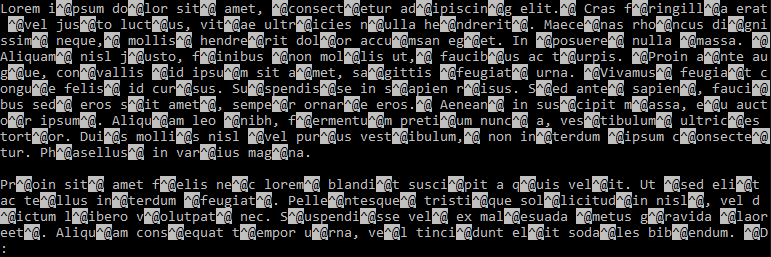
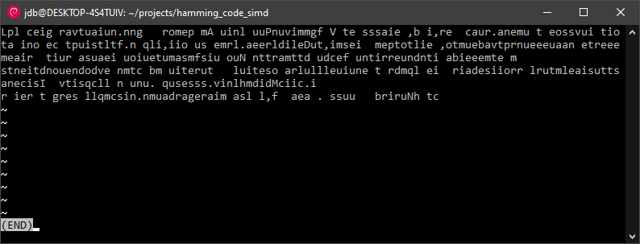
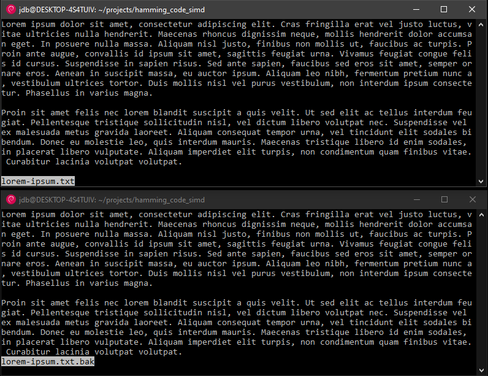
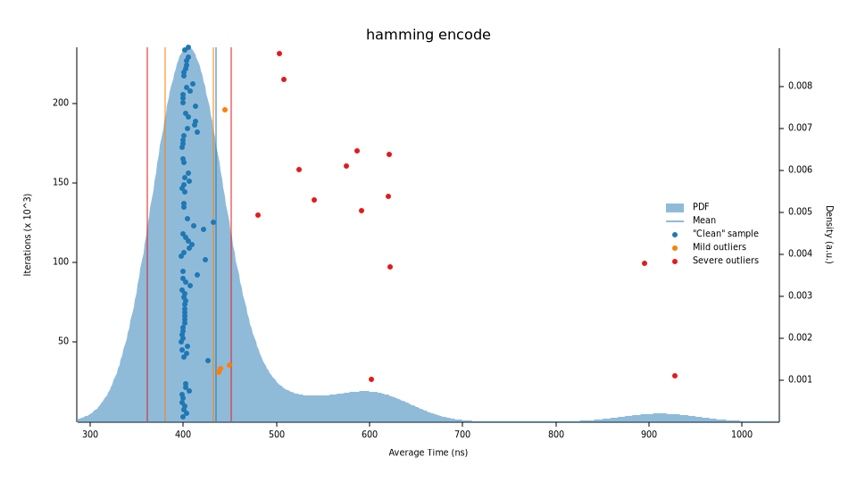
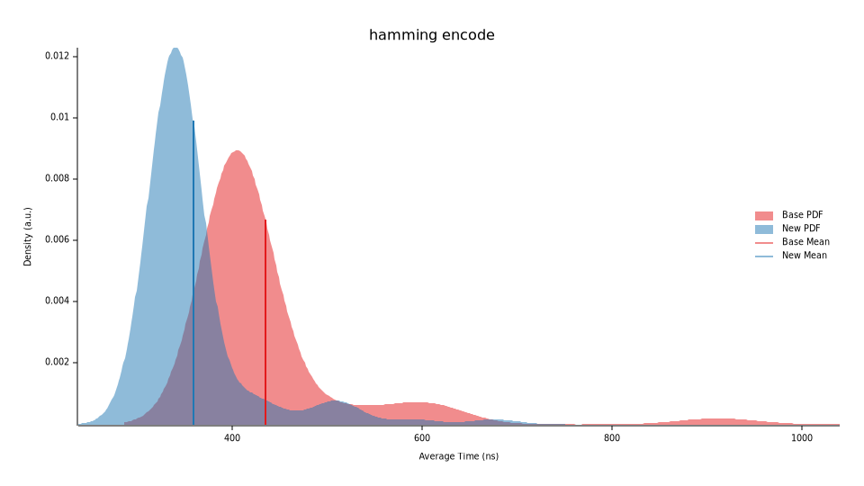
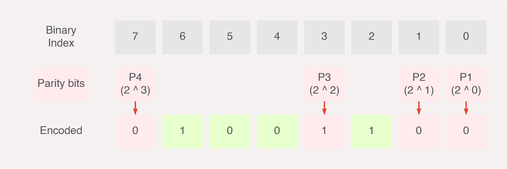
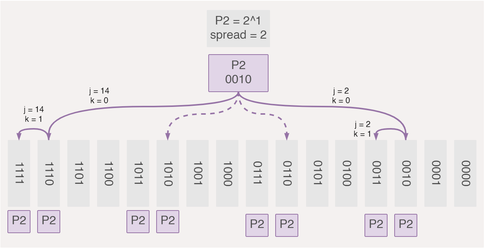
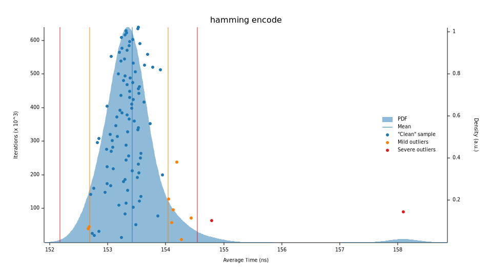

+++
title = "Rediscovering Hamming Code"
description = "Re-exploring the Hamming Code history and implementation. Rewriting the implementation in Rust and improving its performance using neat assembly tricks."
date = 2021-04-18

[taxonomies]
tags = ["rust", "engineering"]

[extra]
note = "if you would like take a closer look at the project, you can find it [here](https://github.com/JuxhinDB/hamming-code)."
+++

A couple of months back I had started reading an interesting book by the late Richard Hamming, "[The Art of Doing Science and Engineering: Learning to Learn](https://www.goodreads.com/book/show/530415.The_Art_of_Doing_Science_and_Engineering)".

It's a good book but we only get one chapter on hamming code (and four on [digital filters](https://en.wikipedia.org/wiki/Digital_filter">digital)); earlier chapters however are definitely word a read. Really and truly I hardly understood most it but I did love the narrative on learning, how to learn, and the story on how the hamming code was discovered.

Since my interest in digital filters was, and is, somewhat non-existent I decided hamming code would be a great place to learn a couple of interesting topics and tools for a few reasons:

* It's a well defined problem domain (no room for interpretation);
* Multiple components with some shared dependency between components;
* Small but not too small of an algorithm to optimise and learn from.

With these characteristics I wanted to explore a few areas around profiling, benchmarking, assembly, concurrency, SIMD and overall bit twiddling all in one place and done gradually.

## Introduction

I will spare the detailed explanation of Hamming code as there is already very work out there, as well as different ways of approaching the problem depending on hardware and software. That said, for both of these cases I highly recommend two videos by [3Blue1Brown](https://www.youtube.com/watch?v=X8jsijhllIA) and [Ben Eater](https://www.youtube.com/watch?v=h0jloehRKas&t=0s).

<div class="youtube-embedded-container">
    <iframe width="100%" height="100%" src="https://www.youtube.com/embed/X8jsijhllIA" title="How to send a self-correcting message (Hamming codes)" frameborder="0" allow="accelerometer; autoplay; clipboard-write; encrypted-media; gyroscope; picture-in-picture; web-share" allowfullscreen></iframe>
</div>

In this particular task I want to be able to do one thing and do it fast. Encode, add noise and decode binary files (yes, technically it's three things). Here are some initial versions trying to encode & decode a lorem ipsum text file.



Well, at least it's roughly equal amount of gibberish. Maybe I got the byte slices all wrong?



Seems like I did but instead of fixing it, I made it worse. Some alignment issues, algorithm issues and endianness issues later we managed to get some basic text encoding & decoding working that would translate well to any binary files (in theory).



Time to apply some synthetic noise on a per-block basis with a 66.67% chance of flipping a single bit. In real world scenarios binary blocks are interleaved to reduce chances of single blocks have more than 1 bit error which Hamming cannot handle.

> The reason for this is that when a bit is damaged in transmission, it tends to occur in a short burst were a few adjacent bits are all flipped altogether. Interleaving blocks builds resiliency against such scenarios.

```none
Block:   0000000001100001011100100111010001100101011100100110000101101000
Encoded: 0011000010111001001110100011001001011100100110000010110110010111
Decoded: 0000000001100001011100100111010001100101011100100110000101101000
Match?   true

Block:   0000000001100001011010010110011101110101011001010110011000100000
Encoded: 0011000010110100101100111011101001011001010110011100010000010011
flipping bit: 12

error at bit: 12
Decoded: 0000000001100001011010010110011101110101011001010110011000100000
Match?   true
```

I tried my hand at some images and somehow made a cursed cat look less terrifying. It's a feature not a bug.


As it turns out, my file reader is only able to process up to, and exactly, 7168 bytes? I decided to not worry about this for now and move on; I'd be more than happy to feedback on alternative ways to write [this](https://github.com/JuxhinDB/hamming-code/blob/main/src/bin/main.rs).

## Implementation

It took some back-of-the-napkin dry runs till I got the crux of the problem and looking at [other similar implementations](https://github.com/tckmn/rustyham/blob/master/src/lib.rs), we narrowed down to something that worked. I wanted something simple, that can be optimised so we landed for the following [initial implementation](https://github.com/JuxhinDB/hamming-code/tree/57e6a63ed75b85dcda82b5ec6f8a9059da300917).

We will be going over each component, (**a**) encoder, (**b**) decoder and (**c**) parity check independently to avoid context switching too much and streamlining the improvements.

## Encoder

The initial encoder is a little bit allover the place but is arguably the simplest part of this implementation. We need to figure how many parity bits, len_power, we need (log2{64 bits} = 6) and from that derive the data width, len (2^6 = 64); you will notice soon enough that this entire dance is not required.

```rust
pub fn encode(block: &mut u64) -> u64 {
    let len_power = (2..).find(|&r| 2u32.pow(r) - r - 1 >= 32).unwrap();
    let len = 2usize.pow(len_power);
    // ...

}
```

These are the only parameters that the encoder needs to be aware of before we can start to encode our message. Starting with `1001` as our example input message, we first go through each bit, see if the index of that bit is a power of 2 and therefore a parity bit. If it is a power of 2, we shift the input message left (i.e. skip the current bit), otherwise we insert the bit into the encoded message as is.

```rust
pub fn encode(block: &mut u64) -> u64 {
    // ...
    let mut code = 0u64;

    for i in 0..len {
        // Check if `i` is not a power of 2
        if (i != 0) && (i & (i - 1)) != 0 {
            code |= (0b1 << i) & *block as u64;
        } else {
            *block <<= 1;
        }
    }
    // ...
}
```

If we were to think of this graphically, it may look something like this, (1) we get our raw input, (2) we map the raw input to the encoded output as part of its data bits and (3) we calculate the parity bits and map them to the encoded output as parity bits.


Let's test the implementation out; the results match the expected output and running through a simple benchmark ([criterion](https://github.com/JuxhinDB/hamming-code/blob/acaf4b9063b2b80a95b38f18dd173104a21d6c9f/benches/benchmark.rs)), does not yield promising results. Our baseline median execution time of **430.44n** for our encoder with a large number of odd outliers. We now have something that we can improve.



There are some definite quick wins we can work with here. For starters, since we know we're always going to work with u64 (or any fixed-width block size), len_power and len do not need to be computed every time we want to encode a block. Let's also remove the [`code`](https://doc.rust-lang.org/std/marker/trait.Copy.html) for the internal encoded variable that is not needed.

```rust
pub fn encode(block: &mut u64) -> u64 {
    let len_power = 6;
    let len = 64;

    let mut code = 0u64;

    // ... Remove `encoded` and work directly on `code` only

    for i in 0..len_power {
        // If the parity check is odd, set the bit to 1 otherwise move on.
        if !parity(&code, i) {
            code |= 0b1 << (2usize.pow(i) - 1);
        }
    }

    code
}
```

Re-running our benchmarks, we now run in a median time of 361.27ns, a ~17.5% performance increase. We're still seeing some outliers, but the average execution time is now bundled up better.



At this stage, there are two branching conditions left in our encoder which I will largely leave as to avoid over optimising early on. Let's profile (via [`perf`](https://en.wikipedia.org/wiki/Perf_(Linux))) and plot (via [`flamegraph`](https://github.com/flamegraph-rs/flamegraph)) our encoder and take a peak at the overall execution time.

> This SVG was hand-edited to save space and keep it interactive. It was not fun and the sample frequency in this sample is low but it translates well enough to larger sample rates (~99Hz).

<div class="img-container">
    <embed style="width:100%" src=flamegraph.svg>
</div>

The primary culprit here is the parity function taking circa ~75% of the total encoder execution time. It's clear that our parity function isn't really doing too great so the next natural step is to optimise it which will positively affect the entire implementation. Referring back to the introduction, this is what I meant by shared component.

## Parity Check

Let's take a boiled down view of the implementation to understand where and how we can optimise our implementation. The parity checker's job is to determine if a certain sequence of bits are either odd (1), or even (0). Recall our encoded message is made up of data bits and parity bits.



If we actually take a look at the indexes of the parity bits, they are always exactly a power of 2. So our set of parity bits P can be rewritten from `P = { P1, P2, P3, P4 }` to `P = { 0001, 0010, 0100, 1000 }` whereby an intuitive and elegant pattern emerges.

* p1 `(0001)` is checking for _all values_ that have 1 as their **firs** bit;
* p2 `(0010)` is checking for _all values_ that have 1 as their **secon** bit;
* p3 `(0100)` is checking for _all values_ that have 1 as their **thir** bit;
* p4 `(1000)` is checking for _all values_ that have 1 as their **fourt** bit.

`P1 = 2^0 = 1` therefore checks for 1 bit, then skips 1 bit. `P2 = 2^1 = 2` checks for 2 bits, then skips two bits. `P3` checks every 4 bits then skips 4 bits and finally `P4` checks every 8 bits then skips 8 bits.

> **Not** &mdash; ignore the _0th_ bit for now. That will be a global parity bit, part of extended hamming code that checks parity **al** bits. We'll get back to this.

This visualiation helps to show how parity bits are spread and interleaved to maximise their coverage of all the binary block.


There are many cases where we do not need to check every bit. For example.

* Parity bit `P4` starts from the 8th element, so there is no need to check the first 8 bits (we may jump ahead);
* Do not iterate over every bit incrementally, instead skip over bits that are not relevant to a given parity bit. If `P2` checks of `0010` and `0011` and skips `0100` and `0101`, then there is no need to iterate over the latter two.

Let's get to our first implementation first and see how we may improve it. Taking a look at our parity check, it may look more involved relative to our encoder.  If we compare it to the points above, we're doing a good job of not starting the loop from the 0th index but rather from the first bit that is relevant for a given parity. One thing we are not doing so well is that this implementation goes over every bit and then determines if we should ignore it or not, which is costly.

```rust
fn parity(code: &u64, i: u32) -> bool {
    let bi = (0b1 << i) - 1;
    let (mut parity, mut ignore, mut counter) = (true, false, 0);
    for j in bi..64 {
        if !ignore && (code & 0b1 << j) != 0b0 {
            parity = !parity;
        }

        counter += 1;
        if counter >= 0b1 << i {
            ignore = !ignore;
            counter = 0;

        }
    }

    parity  // true if even
}
```

Taking a look at the underlying assembly (via cargo-asm with rust flag enabled) we see that there's a lot going on, primarily because of all the counter and ignore checks that we mention above.

```rust
pub fn parity(code: &u64, i: u32) -> bool {
 mov     w9, #1
 let bi = (0b1 << i) - 1;

 lsl     w8, w9, w1
 sub     w10, w8, #1
     cmp     w10, #63
     b.gt    LBB2_3
     mov     w12, #0
     mov     w10, #0
     ldr     x11, [x0]
     sub     w13, w8, #2
     mov     w9, #1
LBB2_2:
     add     w13, w13, #1
 if !ignore && (code & 0b1 << j) != 0b0 {

 lsr     x14, x11, x13
 and     w14, w14, #0x1
 eor     w14, w9, w14
 tst     w12, #0x1

 csel    w9, w9, w14, ne
 counter += 1;
 add     w14, w10, #1
 if counter >= 0b1 << i {
 cmp     w14, w8

 cset    w14, lt
 if counter >= 0b1 << i {
 csinc   w10, wzr, w10, ge

 eor     w12, w14, w12
 eor     w12, w12, #0x1
     cmp     w13, #63
     b.lt    LBB2_2
LBB2_3:
 }
 and     w0, w9, #0x1
 ret
```

My initial impression is that there is not a lot of [branching](https://releases.llvm.org/2.7/docs/LangRef.html#i_br) going on but our loops are simply longer than they need to be. Let's see if we can write the skipping functionality that actually skips bits it doesn't need to compute (as opposed to computing, then deciding if it should skip). After some back-of-the-napkin dry runs, I boiled it down to the following which passes the tests.

```rust
pub fn parity(code: &u64, i: u32) -> bool {
    let mut parity = true;
    let spread = 2u32.pow(i);
    let mut j = spread;

    while j < 64 - spread + 1 {
        for k in 0..spread {
            if (code & 0b1 << j + k) != 0b0 {
                parity = !parity;
            }
        }

        j += 2 * spread;
    }

    parity
}
```

We do away with the `ignore` and `counter` variables and instead skip bits depending on the parity bit we are checking. Whenever we land on a block of bits that we should be checking, we run an internal loop to scan through that entire block, dictated by some spread (i.e. number of consecutive bits we ought to compute) and subsequently jump to the next index.



The emitted assembly is only slightly reduced but is simpler and quicker resulting in a median execution time of **3.76n** versus **72.23ns**.

Remember that 0th bit that we did not cover with our current parity checks? That's a special parity bit that checks the parity of the entire block (including all parity and data bits). This is known as [extended hamming](https://en.wikipedia.org/wiki/Hamming_code#Hamming_codes_with_additional_parity_(SECDED)) code; on top of being able to correct single bit errors, it also allows us to detect (but not correct) two-bit errors. Let's try to achieve this using a naive implementation which goes over each bit and computes the global parity.

```rust
pub fn slow_parity(code: u64) -> bool {
    let mut parity = true;

    for i in 0..63 {
        if code & 0b1 << i != 0 {
            parity = !parity;
        }
    }

    parity
}
```

Running it through our benchmark we can see this takes **7.7907n** median execution time – not great.

```none
slow_parity check       time:   [7.7806 ns 7.7907 ns 7.8013 ns]
Found 12 outliers among 100 measurements (12.00%)
  8 (8.00%) high mild
  4 (4.00%) high severe

```

There is a more intuitive way of tackling this which I took from the book, [Hacker's Delight](https://www.goodreads.com/book/show/276079.Hacker_s_Delight) (vol. 2, p. 96) by  Henry S. Warren Jr. If you haven't come across this book before, I really cannot recommend it enough. It's a goldmine. Here's an excerpt of the relevant section.


Let's implement this, performing a rolling XOR and take the rightmost bit, extended to 64-bit blocks instead of the author's original 32-bit block.

```rust
pub fn fast_parity(code: u64) -> u64 {
    let mut y: u64 = code ^ (code >> 1);

    y ^= y >> 2;
    y ^= y >> 4;

    y ^= y >> 8;
    y ^= y >> 16;
    y ^= y >> 32;

    0b1 & y
}
```

The difference is quite stark. Running it through our benchmark we can see the fast parity check running at **937p** (where 1ps = 0.001ns) median execution time versus **7.7907n** median execution time, translating to roughly a ~8300% improvement.

```none
fast_parity check       time:   [937.54 ps 937.86 ps 938.26 ps]
Found 13 outliers among 100 measurements (13.00%)
  5 (5.00%) high mild
  8 (8.00%) high severe

slow_parity check       time:   [7.7806 ns 7.7907 ns 7.8013 ns]
Found 12 outliers among 100 measurements (12.00%)
  8 (8.00%) high mild
  4 (4.00%) high severe
```

If we compare the assembly code generated we can take a peek as to how this result is achieved thanks to compiler optimisations.

#### Assembly (ARM) &mdash; Fast parity

```asm
hamming_code_simd::hamming::fast_parity (src/hamming.rs:66):
 eor     x8, x0, x0, lsr, #1
 eor     x8, x8, x8, lsr, #2
 eor     x8, x8, x8, lsr, #4

 eor     x8, x8, x8, lsr, #8
 eor     x8, x8, x8, lsr, #16
 lsr     x9, x8, #32
 eor     w8, w9, w8
 and     x0, x8, #0x1
 ret
```

We can now easily use the fast_parity check in our encoder before returning the encoded message at the very bottom.

```rust
code |= fast_parity(code);
```

### Benchmark

Running our benchmarks one more time for both the encoder and decoder yields some promising improvements.

```none
hamming encode time:   [153.33 ns 153.38 ns 153.43 ns]
                        change: [-57.763% -57.720% -57.680%] (p = 0.00 < 0.05)
                        Performance has improved.

hamming decode time:   [118.57 ns 118.60 ns 118.65 ns]
                        change: [-72.866% -72.823% -72.782%] (p = 0.00 < 0.05)
                        Performance has improved.
```

We improved the encoder's performance by <b>57.72%</b> (~153ns) and decoder by <b>72.82%</b> (~118.6ns).

> These results are achieved on ARM and results will vary on x86.



If we contrast this with our previous implementations we can see a much faster execution time as well as more stability (dictated by density) with fewer outliers.


At this stage, this should cover most of the improvements from an algorithm perspective. There may be some room to further optimise the overall parity checker (not the fast global one) but we can get to that later.

## Decoder

The remaining part of our implementation is the decoder. I will not go into as much detail as the implementation is relatively similar.

* Re-calculate every parity bit, if there are any odd parities then we have at least one error;
* Accumulate all the incorrect parities into a single error "check" value;
* If the "check" value is greater than 0, we have an error. Flip the bit corresponding to the "check" value (e.g. if error check is 10110, flip the bit in the 11th index);
* Drop all parity bits and compress all data bits together.

```rust
pub fn decode(code: &mut u64) -> u64 {
    let len_power = 6;
    let len = 64;

    let mut check = 0b0;

    for i in 0..len_power {
        if !parity(&code, i) {
            check |= 0b1 << i;
        }
    }

    // We have an error
    if check > 0b0 {
        *code ^= 0b1 << check;
    }

    // Drop all parity bits
    let mut offset = 0;
    let mut decoded = 0b0;

    for i in 0..len {
        // Check if `i` is not a power of 2
        if (i != 0) && (i & (i - 1)) != 0 {
            decoded |= ((0b1 << i) & *code) >> offset;
        } else {
            offset += 1;
        }
    }


    decoded
}
```

There isn't much else left to add here but I'll still be exploring some ways to speed this up. Keep in mind that right now there is no global parity check.

## Next steps

This post took a while to write but it aims to show how one might go about tackling a problem and later optimising it. The implementation is not feature complete, there are a few boundary checks missing and we are not checking and testing for the global parity bit in the decoder – it's meant to be a gradual learning exercise.

I am contemplating extending this solution to optimise it from a workload distribution standpoint through [SIMD](https://doc.rust-lang.org/edition-guide/rust-2018/simd-for-faster-computing.html) and/or parallel workloads. What happens if we use narrower or wider data blocks (i.e. 256-bit)? Can we calculate how many bytes by second we can process with this encoder using real-world scenarios? What's the expected industry standard and can we get close to (perhaps even leveraging architecture specific instructions).

If you are interested in this or have any feedback you'd like to pass, feel free to [reach out](https://twitter.com/juxhindb), I'd love to hear your input.
