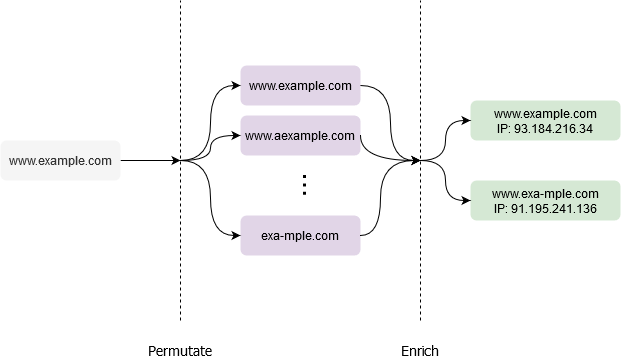
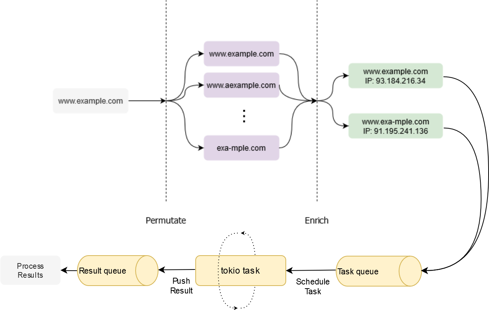
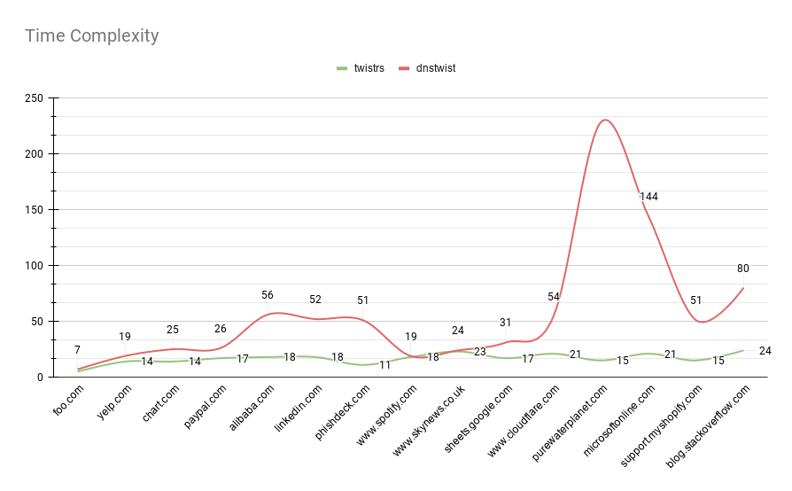
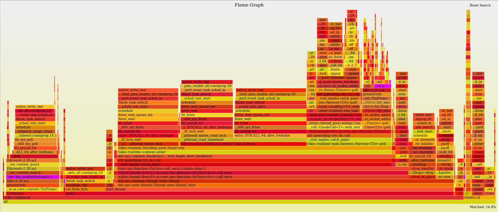

+++
title = "Twistrs — Domain name enumeration library in Rust"
description = "The release of Twistrs, a domain typosquatting library built in Rust."
date = 2020-07-09
[taxonomies]
tags = ["rust", "security"]

[extra]
note = "if you want to skip all of the design and implementation fluff, simply head over to the [Results](#results) section. The project can also be found [here](https://github.com/JuxhinDB/twistrs)"
+++

# Background

Most of my work comes from an information security background. I always had a
growing fascination with Rust over the past couple of years ([pre-1.0](https://stackoverflow.com/questions/32384594/how-to-check-whether-a-path-exists)).
This is my first attempt to really go full-circle with a very small project in
hopes of contributing to the ecosystem. On a more personal note, it forces me
to actually dig my teeth into the language till I finally feel productive with
it.

# Honourable Mentions

Normally this comes at the end of a blog post, however this seemingly small
project took me months to get into a somewhat half-decent state, and it's a
huge thanks to the following folks.

- [@erstejahre](https://twitter.com/Erstejahre)
  For really helping me discover and iron out some horrendous anti-
  patterns in initial implementations and for being a great person and a fantastic
  mentor.
- [@sadisticsystems](https://twitter.com/sadisticsystems)
  My first Rust tutor and a person who takes genuine pride and joy in
  sharing knowledge (irrespective of your background). Drastically helped get
  through first major hurdles in the project early on.
- [@jonhoo](https://twitter.com/sadisticsystems)
  While not someone I interacted with personally, Jon's streams are of
  exceptionally quality for intermediate Rust that greatly demystified a lot of
	Rust concurrency models and internals.

# Introduction

Domain typo-squatting[^1] is nothing new in the security world. There are many tools and [services](https://blog.digital-horror.com/p/10b95404-70b8-474e-87ef-5c03963ed686/dnstwister.report) out there that already allow you to get a snapshot of your domain's attack surface and even subscribe to certain notifications. One particular attack vector that interests me is email misdelivery[^2] and is something I would like to actively monitor for a number of domains.

Twistrs (twisters?) is my first attempt at releasing an open-source library in Rust (previously wrote a small tool called [synner](https://github.com/JuxhinDB/synner)). The internals of the library are a direct port of the well-known [dnstwist](https://github.com/elceef/dnstwist) tool, that I personally loved and used a lot during many of my security engagements, with some minor modifications and changes.

The primary goals behind twistrs, similar to dnstwist, is to enable the following techniques.

1. **Permutation** – Provide domain name permutation algorithms that are fast and simple to use. These are generally [interesting techniques](https://github.com/JuxhinDB/twistrs/blob/master/twistrs/src/permutate.rs#L158-L200) that are used for typo-squatting.
2. **Enrichment** – Extend the library to allow enriching of domains by checking for resolvable domains, domains that are listening to misdirected mail and eventually other enrichment methods such as, but not limited to, HTTP banners, WHOIS lookup, GeoIP lookup and so on.

There are also some secondary requirements that really were the inspiration behind the port that are worth mentioning.

- **Speed** – being mostly network I/O bound, I want to make sure the library is noticeably faster to begin with, despite lacking experience in this area.
- **Memory footprint** – when hosting this, I want to drastically minimise cost of operations–particularly if we want to release a free web interface for users to use.
- **Flexible interface** – domain name permutation and enumeration must be disjoint, but still compliment each other. Additionally the library must not enforce any transport or concurrency implementations on the client.
- **Go full circle** – despite being a very small scope, I want to make sure to treat this like an actual library. Making sure there are tests, that it's documented, maintained and that it's published to crates.io.

# Design

When brainstorming how I think the library would best suit potential users I wanted to make sure that users can pick and choose what they want to use while retaining control over how they want to transport information to-and-fro.

Want a REST API that generates and enriches a given domain? Go ahead. Want a CLI that only enriches a given domain with metadata as part of a larger tool? You can do that too.

With this in mind, the library broken down into two disjoint modules that can be used together to complement each other.



Or choose to skip permutation altogether and just enrich a specified domain with metadata.


The transport layer is up to the client's desired implementation. One trivial implementation is the [twistrs-cli](https://github.com/JuxhinDB/twistrs/tree/master/examples/twistrs-cli) example that uses [tokio mpsc](https://github.com/JuxhinDB/twistrs/tree/master/examples/twistrs-cli) to schedule a large number of host lookups and stream the results back.



> **Note** – the above diagram isn't entirely correct, as there is only one queue, but it's easier to visualise and wrap one's head around.

At this point, I do not see this potentially changing all too much. In the future, it may make sense to provide some runtime out of the box that boils down the client implementation even further (would love to hear thoughts on this).

# Implementation

**Note** – this section is somewhat long-winded. The aim here is to not just explain how I went about implementing the library, but really emphasise the (somewhat painful) journey that led to this point in hopes that it may help less experienced readers understand that brick walls are important to overall progress.

Implementation of the library started with the permutation engine first. The goals here are quite well defined and simple, so it made sense to start here.

1. Map all the permutation methods that are available in [dnstwist.py](https://github.com/elceef/dnstwist/blob/master/dnstwist.py) either equally, or slightly better (full list can be found [here](https://github.com/JuxhinDB/twistrs/tree/06ebdd19302e535adda09307c00e1d9e3403eadb#permutation-modes).
2. Avoid complicating the interface by avoiding `async`. This is in-memory string mutation, so the performance hit is beyond negligible.

### Permutation

The sole purpose of the permutation module (`permutate.rs`) is to be able to, given a root domain, generate `n` similar variants of that domain. The initial implementation of the permutation generation was over-complicated and eventually rewritten.

All functionality is tied around a small data container, `Domain`, that stores some metadata that we use to generate our permutations.

```rust
#[derive(Default, Debug)]
pub struct Domain<'a> {
    pub fqdn: &'a str,

    tld: String,
    domain: String,
}
```

The initial implementation had a single method named [`mutate`](https://github.com/JuxhinDB/twistrs/blob/5d2b49cafec599a78c2f81057be0d1f52a5677e4/src/lib.rs#L157) that effectively acted as a single-entry for one or more permutation operations. Control-flow was determined by an unnecessary enum, `PermutationMode`.

```rust
#[derive(Copy, Clone)]
pub enum PermutationMode {
    All,
    BitSquatting,
    Homoglyph,
    // More ...
}
```

> The initial design philosophy here, was to try to make the interface easier to interact with by only having one entrypoint. The problem with this, as will soon be apparent, is that you are contrained to a lot of hidden behavior behind this one method.

Which meant that instead of doing something intuitive and simple like:

```rust
use twistrs::permutations::Domain;
let homoglyph_permutations = Domain::new("www.rust-lang.org).homoglyph();
```

One would need to resort to a less intuitive implementation with no additional benefit like so:

```rust
use twistrs::permutations::{Domain, PermutationMode};
let homoglyph_permutations = Domain::new("www.rust-lang.com", PermutationMode::Homoglyph);
```

In the end, I opted for a much simpler implementation, removing the `PermutationMode` enum entirely, and simply making all the permutation methods public (there's an [`all()`](https://github.com/JuxhinDB/twistrs/blob/06ebdd19302e535adda09307c00e1d9e3403eadb/twistrs/src/permutate.rs#L84-L106) method aggregates all permutation modes into a single iterator to achieve the original goal).

One other interesting change that I learned along the way, was to return iterators instead of vectors–allowing for some interesting chaining while being easier to operate with:

##### Original method signature

```rust
pub fn permutate(&self, mode: PermutationMode) -> Result<Vec<String>, Error>
```

##### Revised Method Signature

```rust
pub fn all(&self) -> Result<Box<dyn Iterator<Item = String>>>
```

The permutation methods themselves were quite fun to implement and helped play around with a lot of foundational operations in Rust. My particular favourite that I would like to highlight, is the [bitsquatting](https://github.com/JuxhinDB/twistrs/blob/06ebdd19302e535adda09307c00e1d9e3403eadb/twistrs/src/permutate.rs#L119-L164) implementation:

```rust
pub fn bitsquatting(&self) -> Result<Box<dyn Iterator<Item = String>>> {
    let mut result: Vec<String> = vec![];
    let fqdn = self.fqdn.to_string();

    for c in fqdn.chars().collect::<Vec<char>>().iter() {
        for mask_index in 0..8 {
            let mask = 1 << mask_index;


            // Can the below panic? Should we use a wider range (u32)?
            let squatted_char: u8 = mask ^ (*c as u8);

            // Make sure we remain with ASCII range that we are happy with
            if (squatted_char >= 48 && squatted_char <= 57)
                || (squatted_char >= 97 && squatted_char <= 122)
                || squatted_char == 45
            {
                for idx in 1..fqdn.len() {
                    let mut permutation = self.fqdn.to_string();
                    permutation.insert(idx, squatted_char as char);
                    result.push(permutation);

                }
            }
        }
    }

    Ok(Box::new(result.into_iter()))
}
```

For details on how this technique works, I highly recommend recommend reading the referenced blog post[^3]. There is not much left to mention for the permutation generator that is of particular interest. The domain enrichment is where some of the major challenges arise.

### Enrichment

Domain enrichment is really the crux of the library in terms of its usefulness. While we can generate a large number of potential domains; sysadmins, security engineers, infosec officers and so on are particularly concerned with domains that:

- Are registered (i.e. resolve to an IP).
- Are actively hosting something (i.e. HTTP banner).
- Are actively receiving mail (i.e. MX check/SMTP Banner).

Any form of enrichment is generally going to be network I/O bound and assumedly very slow. This means that we need to make sure that (a) tasks are concurrent and (b) tasks are streamed as they are completed. This is relatively new area for me, so there was a lot of learning in this regard.

Before concerning myself with the performance aspect, the initial implementation followed similar roots to the permutation module. We have some DomainMetadata store that maintains interesting information we might want to pass on to the caller and an EnrichmentMode. Similarly, we had an overly complicated pub method named enrich that controlled flow depending on the `EnrichmentMode`.

```rust
type DomainStore = Arc<Mutex<HashMap<String, DomainMetadata>>>;

pub enum EnrichmentMode {
    DnsLookup,
    MxCheck,

    All,
}

pub fn enrich<'a>(
    mode: EnrichmentMode,
    domains: Vec<&'a str>,
    domain_store: &'a mut DomainStore,
) -> Result<&'a DomainStore, &'static str> {
    let domains: Vec<String> = domains.into_iter().map(|x| x.to_owned()).collect();

    match mode {
        EnrichmentMode::DnsLookup => {
        	// Ignore for now
        }
        EnrichmentMode::MxCheck => {
            // Ignore for now
        }
        _ => return Err("enrichment mode not yet implemented"),
    }


    Ok(domain_store)
}
```

The more astute reader might also notice the odd type alias, `DomainStore`. That was a very hacky way of trying to map an FQDN to some domain metadata in a way that was thread-safe. The idea here was to use Rayon's [`into_par_iter()`](https://docs.rs/rayon/1.4.0/rayon/iter/trait.IntoParallelIterator.html#tymethod.into_par_iter) to handle parallelism and store all results in some "mutable domain store".

```rust
let local_copy: Vec<String> = domains.iter().cloned().collect();
let resolved_domains = local_copy.into_par_iter().filter_map(dns_resolvable);

resolved_domains.into_par_iter().for_each(|resolved| {

    let mut _domain_store = domain_store.lock().unwrap();
    match _domain_store.get_mut(&resolved.fqdn) {
        Some(domain_metadata) => {
            domain_metadata.ips = Box::new(resolved.ips);
        }

        None => {
            let domain_metadata = DomainMetadata {

                ips: Box::new(resolved.ips),
                smtp: None,
            };
            _domain_store.insert(resolved.fqdn, domain_metadata);

        }
    }
});
```

The problem with this, apart from being unnecessarily complicated, is that the parallelism is now handled internally by the library, and the outer function (enrich) is blocking, which means that we take away control from the caller and are unable to stream results back. The result looks something like the following GIF:


This implementation clearly wasn't going to cut it, so after some back and forth with [@erstejahre](https://twitter.com/Erstejahre), we came up with a couple of alternative approaches to the problem (even [actix](https://github.com/actix/actix) was on the table at this point).

##### Improvements

After some thought, I opted to boil things down to as simple as I could. The fewer language features, the better and the clearer the library will be.

The EnrichmentMode idea was scrapped entirely, and instead, the internal enrichment methods were boiled down into trivial async functions.

```rust
pub async fn dns_resolvable(&self) -> Result<DomainMetadata> {
    match net::lookup_host(&format!("{}:80", self.fqdn)[..]).await {
        Ok(addrs) => Ok(DomainMetadata {
            fqdn: self.fqdn.clone(),
            ips: Some(addrs.map(|addr| addr.ip()).collect()),
            smtp: None,
        }),
        Err(_) => Err(EnrichmentError),
    }
}
```

This is exceptionally trivial, easier to understand and gives power to the client to handle the concurrency flow themselves, however suits them best.

> Side note–during initial implementation of the smtp enrichment check (i.e. can I send a dummy-email to this domain), I was making use of [lettre](https://docs.rs/lettre/0.9.3/lettre/), which is not async. I instead had to move to [async_smtp](https://docs.rs/async-smtp/0.3.4/async_smtp/) which matches (more or less) the lettre interface, making moving to async literally a two-minute job!

The only major downside to this change, is that the client must now handle the task-scheduling mechanism themselves at all times, which albeit trivial for simpler examples, is not the most ideal. The good news is, that now results can be streamed back, to allow for faster and more responsive processing. Compare the following GIF to the one above.


Another small downside here, is that since there is no shared-state between the async methods, they all return their own `DomainMetadata` for the same domain. This means that there needs to be some trivial `fn join(metadata: Vec<DomainMetadata>) -> DomainMetadata` that merges multiple `DomainMetadata` instances together into one.

### Summary

After weeks of back-and-forth, we were able to come up with the building blocks of this micro-library. With some thoughtful rewrites, we were able to transform the library implementation from something complicated.

```rust
use std::collections::HashMap;

use std::sync::{Arc, Mutex};

use twistrs::enrich::{enrich, DomainStore, EnrichmentMode};
use twistrs::permutate::{Domain, PermutationMode};


let domain = Domain::new("www.example.com").unwrap();

match domain.permutate(PermutationMode::All) {
    Ok(permutations) => {
      let mut domain_store: DomainStore = Arc::new(Mutex::new(HashMap::new()));
      enrich(EnrichmentMode::DnsLookup, permutations, &mut domain_store).unwrap();

      println!("Output: {:?}", &domain_store.lock().unwrap());
    }
    Err(e) => panic!(e),
}
```

To something that is somewhat more intuitive (yes, this is intentionally slow).

```rust
use twistrs::enrich::DomainMetadata;
use twistrs::permutate::Domain;
use futures::executor::block_on;


let domain = Domain::new("www.rust-lang.com").unwrap();
let domain_permutations = domain.all().unwrap();

for d in domain_permutations {
	block_on(domain_metadata.dns_resolvable());
}
```

Overall, I do not see the internals changing, however I do see an additional layer being added that handles the task execution out of the box. Really the aim here is to minimise the code required to get a simple implementation going.

# Results

At this stage of the library, the primary objective was to match dnstwist in terms of permutation methods and at least:

1. Cover two or more enrichment methods (Host lookup & SMTP check).
2. Yield same number of hits or more.
3. Execute at least in same amount of time or better.

Also keep in mind that these results are not really empirical, however they give a rough idea of the performance and results for now. Really the goal here is to detect very obvious red flags.

##### Raw data

The testing is quite trivial–compare [dnstwist](https://github.com/elceef/dnstwist) and [twistrs-cli](https://github.com/elceef/dnstwist) example against a list of domains that increase in char-length with each iteration.

The following is some of the raw data curated over initial tests. Each test was run 5 times and worst-case scenario was picked for both projects.

|         domain         | dnstwist_enriched | dnstwist_execution_time(s) | twistrs_enriched | twistrs_execution_time(s) |
|:----------------------:|:-----------------:|:--------------------------:|:----------------:|:-------------------------:|
| foo.com                | 69                | 7                          | 73               | 5                         |
| yelp.com               | 80                | 19                         | 76               | 14                        |
| chart.com              | 101               | 25                         | 108              | 14                        |
| paypal.com             | 139               | 26                         | 144              | 17                        |
| alibaba.com            | 156               | 56                         | 156              | 18                        |
| linkedin.com           | 178               | 52                         | 158              | 18                        |
| phishdeck.com          | 1                 | 51                         | 2                | 11                        |
| www.spotify.com        | 106               | 19                         | 147              | 18                        |
| www.skynews.co.uk      | 16                | 24                         | 74               | 23                        |
| sheets.google.com      | 94                | 31                         | 167              | 17                        |
| www.cloudflare.com     | 94                | 54                         | 95               | 21                        |
| purewaterplanet.com    | 2                 | 228                        | 3                | 15                        |
| microsoftonline.com    | 118               | 144                        | 122              | 21                        |
| support.myshopify.com  | 102               | 51                         | 410              | 15                        |
| blog.stackoverflow.com | 24                | 80                         | 52               | 24                        |

> **Note** – for dnstwist, the tests were run with the `--registered` flag to ensure that only dns lookup is performed. Likewise, for twistrs only `dns_resolvable()` was run.

##### Domains Enriched

The objective behind this graph is to make sure that twistrs is on-par with dnstwist in terms of the results it yields. For all occasions, bar one, twistrs yields the same number of registered domains or higher.


There seems to be an odd edge-case with https://www.linkedin.com that during the time of writing is unknown, but is being [tracked](https://github.com/JuxhinDB/twistrs/issues/1).

##### Execution Time

While the execution time for twistrs is still not fantastic, I am quite pleased at how linear the execution times are compared to dnstwist. This is particularly evident once we start reaching the longer domains.



There are no major concerns here. One interesting story is that earlier on, when implementing the Tokio mpsc example, I was still yielding sub-par results. Turns out that the previously DNS resolution itself, was not asynchronous. One StackOverflow [question](https://stackoverflow.com/questions/63548625/how-do-you-wrap-synchronous-network-i-o-trivially-with-tokio) later and we found the case of the issue.

##### Performance Remarks

In my first attempt to take a closer look at the internals I decided to profile the CLI example and generate a flamegraph. My initial assumption was that most of the execution time would be allocated to host lookups, however that took 10.8% of total execution time. Instead, most of the time was actually absorbed by Tokio for task scheduling and context switching. I am not quite sure what to make of this just yet; I am more than open to suggestions.



Some other possible ideas revolve around order of performing the host lookups and additonally, being a bit more selective about the permutations that we bother to lookup. As interesting as bitsquatting might be for example, if it generates 5% of permutations, but yields results 0.01% of times, it may not be worth the additional overhead(?).

# Conclusion

### Miscellaneous

I have started documenting the library so that it's available on [docs.rs](https://docs.rs/twistrs/0.1.0-beta/twistrs/). I wanted to mention how fantastic the ecyosystem is for this. The cargo utilities, the automated hosting of docs, the granularity of the documentation itself, is absolutely fantastic, especially coming from the Python world.

Lastly the library is still in early beta stage (`0.1.0-beta`) but it's available on [crates.io](https://crates.io/crates/twistrs) should you wish to play around with it.

### Next Steps

There are still a couple of things to really get out of the way quickly, particularly:

- Understanding how to better handle and propagate errors, and remove a lot of the ugly unwrap(). This is currently a mess and something I need to overhaul.
- Implement remaining enrichment methods that dnstwist implements.
- Go through all the @TODO and @CLEANUP (hint: there is a lot).
- Really take a closer look at the underlying performance. There's definitely room to squeeze out better performance. The project is small and well defined, so it's a great learning ground for performance enhancements.

### Future

The goal in the future is to come up with some interesting client implementations of twistrs. Possible open-sourcing or providing a free tool such as [dnstwister](https://dnstwister.report/) to the public to subscribe to interesting events happening on their domains that is possibly more developer-friendly.

With that I mind, I thank anyone for getting to this point. I would love to hear your thoughts and feedback on the project and interesting ways to take the project further.anyone

[^1]: https://upguard.com/blog/typosquatting
[^2]: https://enterprise.verizon.com/resources/reports/dbir/ (pg 13., fig 13.)
[^3]: http://dinaburg.org/bitsquatting.html
