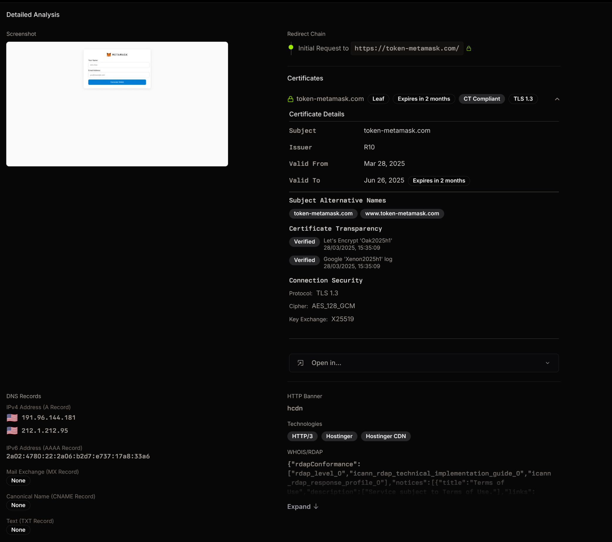

+++
title = "Working with Go in Rust"
description = "Exploring how we went about integrating Go libraries with Rust along with the lessons learnt."
date = 2025-04-16
[taxonomies]
tags = ["rust", "go", "engineering"]
+++
# Introduction

Recently I have been exploring a few libraries I'd like to use to extend the set of security signals that we capture for [Have I Been Squatted](https://haveibeensquatted.com/). The overarching goal is to extract, and derive as many meaningful signals as we can, such that we are able to detect all sorts of bad actors in content-agnostic ways.

One of the libraries that we came across was [`wappalyzergo`](https://github.com/projectdiscovery/wappalyzergo) &mdash; an open-source alternative to the now closed[^1] wappalyzer project. The output of this library provides us with a list of technologies hosted on a given website. For example, knowing if a phishing site uses WordPress and a suspicious plugin significantly improves our ability detect similar websites on different domains. We use therefore use these signals in a number of areas:

* Displaying details to the user
* Targeting bad actor groups via our rule engine
* As a categorical feature for our domain classifier model(s)

The following is a screenshot showing how the details might be presented in the platform.



This library is particularly neat, as it allows us to fingerprint websites without bundling in headless chromium. The complication is that the library is written in Go, and all of Have I Been Squatted's stack is powered by Rust. Rather than trying to rewrite this project in Rust, I wanted to have a solution that we could integrate and extend to other Go libraries in the future.

# Setting the Scene

Before diving into the what's and the how's, it's important to give you, the reader, an understanding of the requirements and constraints that we are working with. I hope this context helps you understand in what situation this solution may (or may not!) be helpful for _you_.

##### Minimal Overhead

Certain parts of our analysis run within lambda functions and we need to make sure that our solution fits within the existing function. No external microservice(s).

##### Ergonomics over Performance
The integration interface needs to be pleasant to use and seamless to other crates within the workspace. This should take priority over maximising performance (more on this later).

##### Extensible
We need to be able to add more Go libraries in the future without breaking existing interfaces.

##### Rapid Development
We need to be able to deliver this fairly quickly and get it in front of users.

Hopefully this should give you a good enough idea on what we are going for.

## FFI

My initial thought, and preferred choice was to integrate Rust & Go through some foreign function interface ([`std::ffi`](https://doc.rust-lang.org/std/ffi/index.html)). As it stands, we cannot simply perform a simple Go to Rust FFI, as Go does not offer a Rust-specific FFI. The path to get there is indirect, relying on C interfaces on both ends.

You would effectively need to export functions using `cgo` and compile your code as a shared library (i.e., a C ABI). Rust, with its robust C FFI can then call these exported functions. Let us briefly go through what this might look like. Implementing this on the Go side, would look something like so.

```go
package main

/*
#include <stdlib.h>
*/
import "C"

// You'd likely want to use unsafe in real-world implementations, I'm omitting
// this to avoid compiler error.
// import "unsafe"

//export wappalyzer
func wappalyzer(a, b *C.char) *C.char {
    // Convert incoming C strings to Go strings, if you need them
    // goA := C.GoString(a)
    // goB := C.GoString(b)

    // For our demo, we'll just return a constant.
    // C.CString allocates with malloc; caller must free.
    return C.CString("cloudflare")
}

func main() {
    // A dummy main so cgo will build a shared library, not a CLI.
}
```

You can then compile the library and header files, outputting both the `.so` and `.h` files respectively.

```bash
go build -buildmode=c-shared -o libgoffi.so ffi.go
```

Besides the atrocious tagging of functions to be exported with comments required by `cgo`, this is a viable option. On the Rust side we would effectively want to link against the `.so` file that we've compiled, and call it through extern C.

```rust
use std::ffi::{CStr, CString};
use std::os::raw::c_char;

// assumes libwapp.so is on your linker path
#[link(name = "goffi", kind = "dylib")]
unsafe extern "C" {
    fn wappalyzer(a: *const c_char, b: *const c_char) -> *mut c_char;
}

fn main() {
    // Prepare some inputs:
    let a = CString::new("input1").unwrap();
    let b = CString::new("input2").unwrap();

    // SAFELY call the foreign function:
    let raw: *mut c_char = unsafe { wappalyzer(a.as_ptr(), b.as_ptr()) };

    // Convert result back into a Rust String:
    let result = unsafe {
        assert!(!raw.is_null());
        let s = CStr::from_ptr(raw).to_string_lossy().into_owned();
        // free the C-allocated string to avoid leaks:
        libc::free(raw as *mut libc::c_void);
        s
    };

    println!("wappalyzer returned: {}", result);
}
```

This is of course simplified; there is some surrounding work around the linker but this is the gist of it. It also gets more complicated as we want to pass structs around. I had initially planned to adopt this option as it was the most performant. It avoids de-/serialising data back and forth along with multiple memory copies and allocations. It's also not as complex as trying to get the Rust and Go binaries to share some common memory region (e.g., via [`shm`](https://man7.org/linux/man-pages/man7/shm_overview.7.html)[^2]).

## `rust2go`

The fact that we had to go about this indirectly really bothered me. I kept digging and came across the [`rust2go`](https://github.com/ihciah/rust2go) project which seemed impressive. Equally impressive is the magnificent [blog post](https://en.ihcblog.com/rust2go/) by Hai Chi, which I encourage anyone interested in this area to read a few times. Unfortunately while impressive, this flips the order of integration. What I was hoping to find, was something akin to `go2rust` instead, so this option was ruled out. However, the blog post did spark a simpler idea I hadn't thought of.

## Unix Domain Socket (UDS)

Another approach I is to rely on inter-process communication (IPC) via unix sockets. Rather than having C ABI be our interface boundary, we can rely on a wire protocol (e.g., protobuf) to pass requests and responses.

This is a useful for a number of reasons:

* Simple implementation
* Keeps boundaries separate
* Avoids memory safety issues
* Able to run locally within the same lambda runtime context

The largest tradeoff here is performance. We need to serialise and deserialize large buffers (i.e., entire website DOMs) along with multiple kernel copies from our applications to the kernel. Given that we're passing relatively large buffers, using [`MSG_ZEROCOPY`](https://www.kernel.org/doc/html/latest/networking/msg_zerocopy.html) could be used to alleviate some of the performance penalty. Another tradeoff is the upfront work needed to get everything hooked up which. You'll need listeners on both ends, with their own read-eval loops and a shared proto spec.

I'd like to give a brief overview on how we can go about implementing this. There's quite a bit of work, so I'll only focus on key areas that are worth mentioning.

## Wire protocol

For starters, we need to have some sort of network representation of our structs and arguments, so that we can de-/serialise them in both Go and Rust. I'm opting for `protobuf` only due to having experience working with it, but you could pick any network representation that suits you. Our `Request` message might look like so.

```proto
// Request is the message sent from Rust to Go
message Request {
  string request_id = 1;  // Unique identifier for correlating requests with responses
  RequestType type = 2;
  oneof payload {
    WappalyzerRequest wappalyzer = 3;
    // Add more request types here
  }
}
```

The key part to note here is the `request_id`. Since we have multiple tasks dispatching these requests, we cannot guarantee the order of them being processed. We use this `request_id` to tie a `Response` to a pending `Request`. The `Response` is very similar, but includes added information around the status.

```proto
// Response is the message sent from Go back to Rust
message Response {
  string request_id = 1;  // Matches the request_id from the original request
  bool success = 2;
  string error = 3;
  oneof payload {
    WappalyzerResponse wappalyzer = 4;
  }
}
```

## Go

From the Go side we should have a thin server that handles connections, and delegates the requests to the different handlers depending on the type. These snippets are **significantly** reduced for clarity.

```go
// Serve starts accepting connections on the provided listener
func (s *Server) Serve(ctx context.Context, listener net.Listener) {
    var wg sync.WaitGroup

    // Create a context that can be canceled
    ctx, cancel := context.WithCancel(ctx)
    defer cancel()

    conn, err := listener.Accept()
    if err != nil {
        log.Printf("Error accepting connection: %v", err)
        continue
    }

    for {
        // Add to wait group before starting goroutine
        wg.Add(1)
        go func(conn net.Conn) {
        	defer wg.Done()
        	s.handleConnection(ctx, conn)
        }(conn)
    }
}
```

Our call to `handleConnection` parses and routes the request to the underlying request type handler. In this example, it would make the call to `handleWappalyzerRequest` and propagate the response back.

```go
func (h *Handler) handleWappalyzerRequest(ctx context.Context, requestID string, req *pb.WappalyzerRequest) (*pb.Response, error) {
	technologies, err := h.wappalyzerService.Detect(ctx, req.Url, req.Headers, req.Body)
	// Convert to protobuf response
	techResponse := &pb.WappalyzerResponse{
		Technologies: make(map[string]*pb.Technologies),
	}

	for category, techs := range technologies {
		logger.Info().
			Str("request_id", requestID).
			Str("category", category).
			Strs("technologies", techs).
			Msg("category technologies")

		techResponse.Technologies[category] = &pb.Technologies{
			Names: techs,
		}
	}

	return &pb.Response{
		RequestId: requestID,  // Set the request ID in the response
		Success: true,
		Payload: &pb.Response_Wappalyzer{
			Wappalyzer: techResponse,
		},
	}, nil
}
```

The response in turn gets written back to our socket. This means we can now move over to the Rust side to see how the response would be parsed there.

## Rust

We have our container that handles all the internals of managing requests and responses.

```rust
type PendingMap = Arc<Mutex<BTreeMap<String, oneshot::Sender<Response>>>>;

/// Gopher service manager
#[derive(Debug, Clone)]
pub struct Gopher {
    config: GopherConfig,

    /// Writer half of the Unix stream for sending requests
    writer: Arc<Mutex<OwnedWriteHalf>>,
    pending: PendingMap,
}
```

The most important being our `wappalyzer` request handler and our `recv` loop. Starting with our request creation, this is how we'd go about dispatching the wappalyzer request to the socket through the [`OwnedWriteHalf`](https://docs.rs/tokio/latest/tokio/net/unix/struct.OwnedWriteHalf.html).

```rust
pub async fn wappalyzer(
    &self,
    url: String,
    headers: HashMap<String, String>,
    body: Vec<u8>,
) -> Result<Response, GopherError> {
    let request_id = uuid::Uuid::new_v4().to_string();
    let message = Request {
        request_id,
        r#type: RequestType::Wappalyzer.into(),
        payload: Some(Payload::Wappalyzer(WappalyzerRequest {
            url: url.clone(),
            headers,
            body,
        })),
    };

    let (tx, rx) = oneshot::channel();

    // Prefer visually distinct lock scopes for clarity
    {
        let mut pending = self.pending.lock().await;
        pending.insert(message.request_id.to_string(), tx);
    }

    {
        let mut stream = self.writer.lock().await;
        let encoded_message = message.encode_length_delimited_to_vec();
        tracing::debug!(
            "attempting to send message to hibs-gopher: {} bytes",
            encoded_message.len()
        );
        stream
            .write_all(encoded_message.as_slice())
            .await
            .map_err(GopherError::SocketError)?;
        tracing::debug!("message sent to hibs-gopher");
    }

    // @CLEANUP(juxhin): propagate the underlying error
    rx.await.map_err(|_| GopherError::ResponseChannelClosed)
}
```

What I initially liked most about this approach was that crates that use this internal library do not have to worry about the internals (besides handling errors).

Our `recv` listens for a message, and pulls the necessary number of bytes based on the variable integer size. We went with varint here as our message sizes vary quite a bit, and the upperbound is very high, albeit infrequently so.

```rust
pub async fn recv(
    pending: PendingMap,
    mut reader: OwnedReadHalf,
) -> Result<(), GopherError> {
    loop {
        // Read the varint-encoded length prefix.
        let message_len = match Self::read_varint(&mut reader).await {
            Ok(len) => len as usize,
            Err(e) => {
                tracing::error!("error reading varint length from socket: {e:?}");
                continue;
            }
        };

        // Allocate a buffer for the full message.
        let mut message = vec![0u8; message_len];
        if let Err(e) = reader.read_exact(&mut message).await {
            tracing::error!("error reading message body: {e:?}");
            tokio::time::sleep(Duration::from_millis(100)).await;
            continue;
        }

        // Attempt to decode the response.
        if let Ok(response) = proto::Response::decode(&message[..]) {
            let request_id = response.request_id.clone();
            let mut pending = pending.lock().await;
            if let Some(tx) = pending.remove(&request_id) {
                let _ = tx.send(response);
            } else {
                tracing::warn!("no pending requests found for response {request_id}");
            }
        } else {
            tracing::error!("unable to parse bytes into `proto::Response`, bytes: {message:?}");
            continue;
        }
    }
}
```

<details>
  <summary>What is a variable integer?</summary>

  While not part of the main blog post, I wanted to share a bit more about the variable integer length. In short, varint allows us to encode an integer using _one or more_ bytes. The integer we're encoding is the size of the protobuf message and protobuf uses base-128[^3] varint to encode unsigned integers.

  The lower 7 bits are for data, and the most-significant bit (MSB) is a continuation flag. Effectively telling us if there's more data we need to be aware of or if it's the final byte.

  When we receive a message on the Rust side, we need to know the size of the message to consume from the socket. Here's the Rust snippet that handles this. It's quite unwieldy but I found it fun to write.

  ```rust
  // Reads a varint-encoded u64 from the given AsyncRead (e.g. your OwnedReadHalf).
  async fn read_varint<R: tokio::io::AsyncRead + Unpin>(reader: &mut R) -> io::Result<u64> {
      let mut result: u64 = 0;
      let mut shift: u32 = 0;
      loop {
          let mut buf = [0u8; 1];
          reader.read_exact(&mut buf).await?;
          let byte = buf[0];
          result |= ((byte & 0x7F) as u64) << shift;
          if byte & 0x80 == 0 {
              break;
          }
          shift += 7;
          if shift >= 64 {
              return Err(io::Error::new(
                  io::ErrorKind::InvalidData,
                  "varint too long",
              ));
          }
      }
      Ok(result)
  }
  ```

  In production scenarios you should likely avoid rolling your varint implementation and consider using [`prost::decode_length_delimited`](https://docs.rs/prost/latest/prost/trait.Message.html#method.decode_length_delimited).
</details>

And that is effectively it. The receiver's job is to notify tasks when a response to their request is complete; adding new request types will not change this.

Binary crates that utilise this would simply connect the service on startup, and use the interface depending on what function they need.

```rust
let gopher = Gopher::try_connect(&gopher_config.gopher).await?;
let wappalyzer = gopher.wappalyzer(..a..arg).await?;
```

# Parting thoughts

I had initially chosen to implement solve this using unix sockets. Looking back, while I did find using UDS pleasant, the choice was suboptimal. I initially prioritized simplicity, yet our chosen solution introduced significant complexity &mdash; something that, in hindsight, seems unjustified for a single function call. Writing this post clearly highlights this as we only needed to enable a single function call at the end of the day:

```go
technologies, err := h.wappalyzerService.Detect(ctx, req.Url, req.Headers, req.Body)
```

Opting for a background process to handle this meant:

* Needing to pack the binary into the final lambda function
* Paying a significant performance penalty albeit not a limiting factor for our use-case
* Introducing a lot more scaffolding required to get everything up and running

This setup is more viable in situations where more complex processing or integrations need to happen on the Go side. If our integrations require no context and are not async, then simply exporting them once as a dynamic library would have been the way to go. We would have achieved the same friendly usage by wrapping the `unsafe` calls in a safe interface, similar to the existing one, and would just need to be sure to free any allocated memory since we have no garbage collector.

I'm grouping these into a small decision matrix. Hopefully this may help readers who are considering integrating Go into their Rust workspace.

| **Criteria**                          | **Go-Rust FFI** (via C ABI)                | **Unix Domain Socket**                      | Rust rewrite                   |
|:---------------------------------------|:--------------------------------------------:|:---------------------------------------------:|:--------------------------------:|
| **Complexity (setup)**                | 🔶   | 🔴   | 🔴🔴🔴 |
| **Performance**                       | 🟢   | 🔴   | 🟢     |
| **Ergonomics**                        | 🔴🔴 | 🟢🟢 | 🟢     |
| **Extensibility**                     | 🔶   | 🟢🟢 | 🔴     |
| **Debugging & Maintenance**           | 🔴   | 🔶   | 🟢     |
| **Deployment Complexity**             | 🔶   | 🔴🔴 | 🟢     |
| **Suitability for Lambda**            | 🟢   | 🔶   | 🟢     |

**Legend**: 🟢 = Good, 🔶 = Acceptable, 🔴 = Poor


Lastly if you made it this far, do check out [Have I Been Squatted](https://haveibeensquatted.com/). We've poured a lot of effort into the platform and we hope to open it up more as we grow!


[^1]: https://news.ycombinator.com/item?id=37236746
[^2]: https://github.com/sfackler/rust-posix-ipc
[^3]: https://protobuf.dev/programming-guides/encoding/#varints
