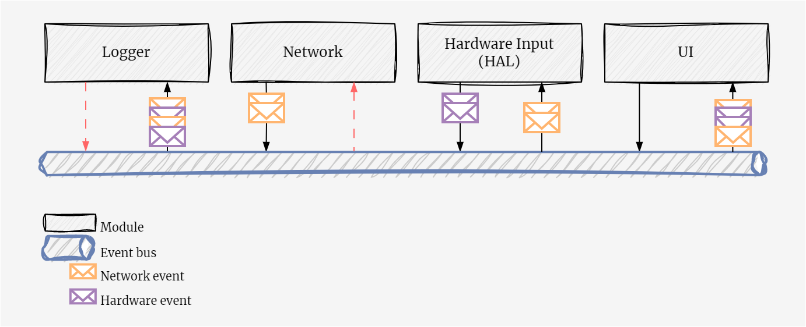
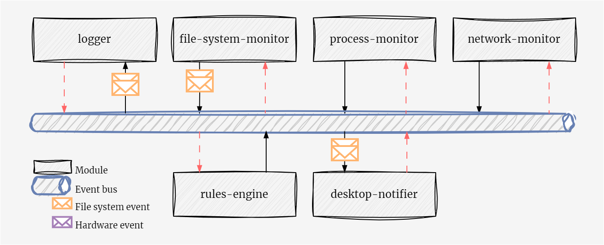

## Introduction

> **Note** &mdash; throughout the post I use channels and bus interchangeably. While there is certainly overlap, they are not exatly the same. Channels refer to the low-level construct used for thread or task communication which is what we are doing. The event bus pattern however can be applied at multiple layers with increasing degrees of abstraction.

Lately I have been looking to learn and experiment more with lower level systems engineering projects. One of these ideas was to build a nifty little product, similar to the [FlipperZero](https://flipperzero.one/) that acts as a fun, educational, offensive WiFi security device &mdash; the initial plan being to base it off of the Raspberry Pi 0W and combining eBPF to have a very low footprint. 

Before digging into the network aspect of the device I decided to begin with higher level requirements and build a small framework that will enable an effective development and implementation of the device. A key requirement is the ability for different parts of the device to operate asynchronously, such as UI updates, hardware inputs, listening to network traffic as well as auxiliary functions such as logging. We need to allow for modules to operate independently while also being able to listen to what other modules are doing.

One common pattern that enables effective communication between these different modules is the event bus pattern. This post aims to introduce the pattern briefly, with a concrete example[^1], and how it enables this particular use-case. We will be implementing an example event bus in Rust using the `tokio` runtime, focusing on a use case where different modules within our system need to communicate with each other.

## Event Bus Pattern

The event bus pattern provides a mechanism for different parts of a system to communicate with each other without needing to be directly connected. Modules send events to the bus and listen for events from the bus. This decouples senders and receivers of events, allowing for more flexible and scalable systems. It is a particularly powerful pattern when we need **loose couping** and **asynchronous communication** between parts of the system, among other properties. 

As with all solutions, it does not come without its own set of tradeoffs. For starters, modules will be eventually consistent which makes it difficult to enforce state transitions consistently without any bugs. Order of events is also not guaranteed between modules, which is particularly problematic when a module might depend on the state and order of two or more modules.

### Examples

Taking a look at back at the original project idea, an example would include a couple of key modules that drive the device. We would need a `logger` module that gives us a deep understanding of module behaviour during runtime, a `network` module that manages sending and receiving of network traffic, a `hardware` module that can signal hardware changes such as key presses and finally a `ui` module that displays everything in a neat interface. 



The different coloured messages signal events sent and received by different modules. The key thing to note here is that order is not guaranteed and may be something you need to factor in substantially particularly if you have some expected state flow/machine. 

These are simple examples, quite frankly I'm not certain this is how things will turn out in the end. I can see a situation where UI/hardware are driven by a single module if we are driving this through an e-ink or LCD display, otherwise we'll need to have HAL interfaces in two modules!

Another example worth mentioning is [Pulsar's](https://github.com/Exein-io/pulsar/tree/main/crates/modules) module system, which has been my inspiration for adopting the pattern. This is a lot more refined than my previous example, where we have a number of modules that monitor or perform specific operations on a Linux system and emit notable events.



In our example we'll be focusing on a broadcasting event bus&mdash;somewhat different to a publish-subscribe pattern. The reason for this is simplicity in implementing and explaining the pattern; other adaptations of this may be thought of as subsets of this pattern. In our example all actors receive messages on the bus and it is up to each actor to know which messages to ignore and which to process.

## Implementing an Event Bus with Tokio

The `tokio` runtime in Rust provides the tools necessary to implement an event bus pattern. In particular, `tokio` provides a broadcast channel that is well-suited to this task. A broadcast channel allows a single sender to notify multiple receivers, which aligns perfectly with our need for a single event bus to communicate with multiple modules.

We implemented our `EventBus` as a wrapper around a `tokio::sync::broadcast` channel. The `EventBus` allows any module to clone it and send events, effectively acting as a publisher. On the other hand, any module can also listen for events from the `EventBus`, acting as a subscriber.

Here is a simplified version of our `EventBus` implementation:. We define our core structures, the `Event` struct and the `EventKind` enum. The former is the ultimate message that is sent to the bus. The latter helps distinguish between events generated by different modules, useful for control flow or filtering.

```rust
use tokio::sync::broadcast;

#[derive(Clone, Debug)]
pub struct Event {
    pub module: String,
    pub inner: EventKind,
}

#[derive(Clone, Debug)]
pub enum EventKind {
    StubEvent(String),
}
```

The last part is defining the `EventBus`, which uses [`tokio::broadcast`](https://docs.rs/tokio/latest/tokio/sync/broadcast/index.html). Internally we pack a [`sender`](https://docs.rs/tokio/latest/tokio/sync/broadcast/struct.Sender.html) which can be cloned for each module that wishes to send events to the bus. 

A module can optionally also subscribe to the bus, yielding a [`Receiver`](https://docs.rs/tokio/latest/tokio/sync/broadcast/struct.Receiver.html) that can listen to all events sent to the bus.

```rust
struct EventBus {
    sender: broadcast::Sender<Event>,
}

impl EventBus {
    fn new() -> Self {
        let (sender, _) = broadcast::channel(100);

        Self { sender }
    }

    fn subscribe(&self) -> broadcast::Receiver<Event> {
        self.sender.subscribe()
    }

    fn publish(&self, event: Event) {
        let _ = self.sender.send(event);
    }
}
```

The implementation is trivial and omits a number of additional features and controls (e.g., configuring the bounds to not be hard-coded). It should however give an idea of how the general pattern may be used.

## Introducing the concept of Modules

With the basic event bus ready, we turn over to implementing the concept of a `Module`. Each module encapsulates some unit of work that operates independently of other modules. The implementation is quite straightforward, starting with our definitions.

```rust
use crate::event_bus::{Event, EventBus};

use anyhow::Result;
use async_trait::async_trait;
use tokio::sync::broadcast;

#[async_trait]
pub trait Module {
    fn new(ctx: ModuleCtx) -> Self;
    async fn run(&mut self) -> Result<()>;
}

#[derive(Debug)]
pub struct ModuleCtx {
    pub name: String,
    pub sender: broadcast::Sender<Event>,
    pub receiver: broadcast::Receiver<Event>,
}
```

We define a `Module` trait which acts as the common denominator across all modules in our system, allowing us to enforce standard interfaces across all modules ensuring that all modules are runnable and fallible. `ModuleCtx` on the other hand is the module's context. Right now it's quite trivial, we simply keep track of our sender and receiver handles to the event bus&mdash;additional context such as module name, interesting events, logging format etc., are typical extensions that you may expect to add.

A `ModuleCtx` is initialised by receiving a reference to our bus, [cheaply](https://docs.rs/tokio/latest/tokio/sync/broadcast/index.html) cloning a sender in order to emit events and subscribing to the bus to start receiving events.

> There are multiple scenarios where a module only needs to listen to events or emit events rather than do both. It may be beneficial to allow for each module to instead handle the initialisation of the module context instead.

```rust
impl ModuleCtx {
    pub fn new(name: &str, bus: &EventBus) -> Self {
        let sender = bus.sender.clone();
        let receiver = bus.subscribe();

        ModuleCtx { 
            name: name.to_string(), 
            sender, 
            receiver 
        }
    }
}
```

## Minimal example

With modules, events and the event bus defined, we can start implementing a few basic modules. In our example we choose to create two modules.

1. Networking module that listens to all network traffic over WiFi and emits interesting packets to the bus.
2. Auxiliary logging module that listens to all events on the bus and logs them neatly.

#### Network module

> Initially this example was meant to use [`libpnet`](https://docs.rs/pnet/latest/pnet/) to create a listener. It was substantially longer and deviated from the purpose of the post as so was reduced to a more concise form.

All modules follow the same setup structure. The bare minimum is for the module to contain a module context. Will omit this from the next example.

```rust
use crate::event_bus::{Event, EventKind};
use crate::module::{Module, ModuleCtx};
use anyhow::Result;
use async_trait::async_trait;

pub struct Network {
    ctx: ModuleCtx,
}
```

The interesting aspect is the `run()` implementation. The core of the implementation is important&mdash;a continuous loop ensures the task stays running and within the loop we leverage []`tokio::select!`](https://tokio.rs/tokio/tutorial/select) as a means of adding concurrency and control flow within our modules. In our example we have one control branch, which runs whenever the `interval.tick()` future completes and in doing so, emits an event to the bus. 

This pattern can be extended substantially. A real-world use case would be having a module that handles streaming data to a client. In that case we may have two control flows.

1. First future that keeps track of the client connection state and uses a [`oneshot`](https://docs.rs/tokio/latest/tokio/sync/oneshot/index.html) channel to indicate when a client is closed.
2. Second future that waits to receive an event on the event bus.

> In order to enforce polling order of the branches, you would need to use the [`biased;`](https://docs.rs/tokio/latest/tokio/macro.select.html#fairness) flag. This is useful to ensure that you are not trying to send data to a closed connection.

```rust
#[async_trait]
impl Module for Network {
    fn new(ctx: ModuleCtx) -> Self {
        Worker {
            ctx,
        }
    }

    async fn run(&mut self) -> Result<()> {
        let mut interval = tokio::time::interval(tokio::time::Duration::from_secs(5));

        loop {
            tokio::select! {
                _ = interval.tick() => {
                    let event = Event {
                        module: self.name.to_string(),
                        inner: EventKind::StubEvent("Received some packet".to_string()),
                    };
                    self.ctx.sender
                        .send(event)
                        .unwrap();
                },
            }
        }
    }

}
```

#### Logger module

The logger module is fairly trivial, the core of the module again is the `run()` function. This waits for any event on the message and can choose how to pretty-print and log it to the console.

```rust
async fn run(&mut self) -> Result<()> {
    loop {
        tokio::select! {
            e = self.ctx.receiver.recv() => {
                match e {
                    Ok(event) => {
                        match event.inner {
                            EventKind::StubEvent(message) => println!("{}: received event: {}", &self.name, message),
                        }
                    },
                    Err(e) => println!("Error: {}", e),
                }

            },
        }
    }
}
```

#### Starting the engine up

On startup, we create the event bus, initialise the modules and run them. We start by creating the event bus, then proceed to create each module manually. I use [`tokio::join!`](https://docs.rs/tokio/latest/tokio/macro.join.html) as a helper macro to run all the modules concurrently and only stop when all modules have stopped.

```rust
#[tokio::main]
async fn main() -> Result<()> {
    let event_bus = EventBus::new();

    let logger_ctx = ModuleCtx::new("logger", &event_bus);
    let mut logger = Logger::new(logger_ctx);

    let network_ctx = ModuleCtx::new("network", &event_bus);
    let mut network = Network::new(network_ctx);

    tokio::join!(network.run(), logger.run()).0?;

    Ok(())
}
```

Running the application now allows us to see the modules in operation.

```bash
~/dev/event-bus-example (main ✔) ᐅ cargo r
   Compiling event-bus v0.1.0 (~/dev/event-bus-example)
    Finished dev [unoptimized + debuginfo] target(s) in 1.09s
     Running `target/debug/event-bus`
logger: received event: Completed some work
logger: received event: Completed some work
logger: received event: Completed some work
```

You can find the entire code in the [example repository](https://github.com/JuxhinDB/event-bus-example).

## Conclusion

The event bus pattern provides a powerful mechanism for communication in a modular system. With Rust's `tokio` runtime, we can implement an event bus that allows for asynchronous, non-blocking communication between different modules.

However, there's still more to explore. The current implementation can be enhanced further by adding more sophisticated event types, better error handling, and perhaps even integrating with other asynchronous libraries and frameworks. This exploration forms the foundation for building more complex, robust and flexible systems in Rust.

[^1]: https://github.com/JuxhinDB/event-bus-example/blob/main/src/main.rs
